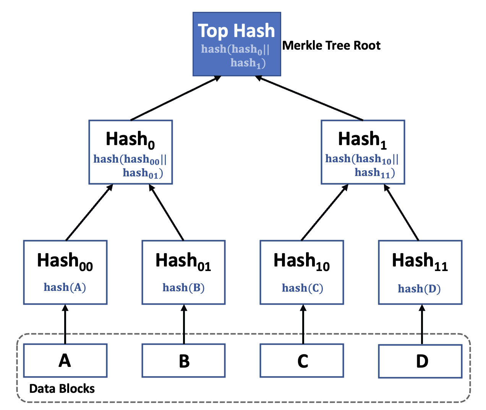
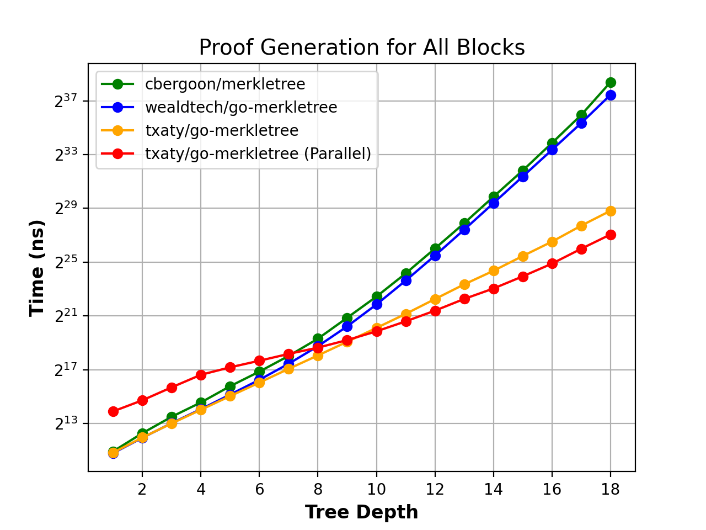
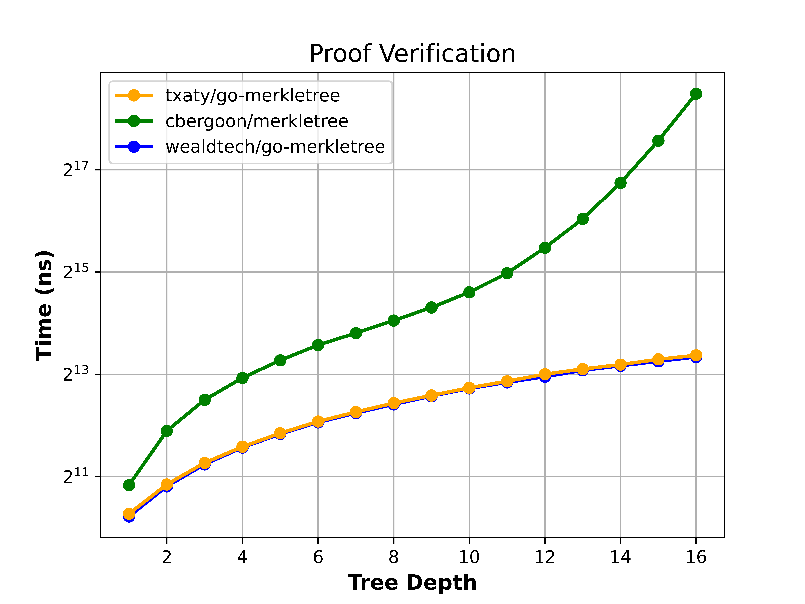

# Go Merkle Tree

[](https://pkg.go.dev/github.com/txaty/go-merkletree)
[](https://goreportcard.com/report/github.com/txaty/go-merkletree)
[](https://codecov.io/gh/txaty/go-merkletree)
[](https://app.codacy.com/gh/txaty/go-merkletree/dashboard?utm_source=gh&utm_medium=referral&utm_content=&utm_campaign=Badge_grade)
[](https://opensource.org/licenses/MIT)

High performance Golang Merkle Tree, supporting parallelization and OpenZeppelin sibling-sorting.

## Merkle Tree

Below is a Merkle Tree data structure sample illustration generated by the set of data blocks {A, B, C, D}.
Each leaf node of the tree corresponds to the hash value of a block in the data block set,
whereas each branch node corresponds to the hash value of the concatenation of the child node hashes (i.e. Hash(
hash_a || hash_b),
or Hash(hash_a + hash_b)).This structure is particularly beneficial for proof of membership/existence.
In order to demonstrate the presence of a data block, such as block C, one merely requires Hash_11, Hash_0,
and the Top Hash (i.e., Merkle Root).
The individual can subsequently calculate new Hash_10, Hash_1, and Top Hash,
and compare the new Top Hash with the previous one to verify whether the block exists in the data block set.


<div align="center">
    
</div>

## Installation

```bash
go get -u github.com/txaty/go-merkletree
```

## Configuration

```go
// Customizable hash function used for tree generation.
HashFunc TypeHashFunc
// Number of goroutines run in parallel.
// If RunInParallel is true and NumRoutine is set to 0, use number of CPU as the number of goroutines.
NumRoutines int
// Mode of the Merkle Tree generation.
Mode TypeConfigMode
// If RunInParallel is true, the generation runs in parallel, otherwise runs without parallelization.
// This increase the performance for the calculation of large number of data blocks, e.g. over 10,000 blocks.
RunInParallel bool
// SortSiblingPairs is the parameter for OpenZeppelin compatibility.
// If set to `true`, the hashing sibling pairs are sorted.
SortSiblingPairs bool
// If true, the leaf nodes are NOT hashed before being added to the Merkle Tree.
DisableLeafHashing bool
```

To define a new Hash function:

```go
func myHashFunc(data []byte) ([]byte, error) {
    sha256Func := sha256.New()
    sha256Func.Write(data)
    return sha256Func.Sum(nil), nil
}
```

> **Critical Advisory:** It's essential to ensure that the hash functions employed by parallel algorithms are
*concurrent-safe*.
> `DefaultHashFunc`, which is the default hash function used for tasks executed sequentially in this library, does NOT
> offer concurrent-safety, given its re-utilization of the same SHA256 digest.

## Example

### Proof generation and verification of all blocks

```go
package main

import (
    "crypto/rand"
    "fmt"

    mt "github.com/txaty/go-merkletree"
)

// first define a data structure with Serialize method to be used as data block
type testData struct {
    data []byte
}

func (t *testData) Serialize() ([]byte, error) {
    return t.data, nil
}

// generate dummy data blocks
func generateRandBlocks(size int) (blocks []mt.DataBlock) {
    for i := 0; i < size; i++ {
        block := &testData{
            data: make([]byte, 100),
        }
        _, err := rand.Read(block.data)
        handleError(err)
        blocks = append(blocks, block)
    }
    return
}

func main() {
    blocks := generateRandBlocks(10)
    // the first argument is config, if it is nil, then default config is adopted
    tree, err := mt.New(nil, blocks)
    handleError(err)
    // get proofs
    proofs := tree.Proofs
    // verify the proofs
    for i := 0; i < len(proofs); i++ {
        ok, err := tree.Verify(blocks[i], proofs[i])
        handleError(err)
        fmt.Println(ok)
    }
    // or you can also verify the proofs without the tree but with Merkle root
    // obtain the Merkle root
    rootHash := tree.Root
    for i := 0; i < len(blocks); i++ {
        // if hashFunc is nil, use SHA256 by default
        ok, err := mt.Verify(blocks[i], proofs[i], rootHash, nil)
        handleError(err)
        fmt.Println(ok)
    }
}

func handleError(err error) {
    if err != nil {
        panic(err)
    }
}
```

### Build tree and generate proofs for a few blocks

```go
blocks := generateRandBlocks(10)

// create a Merkle Tree config and set mode to tree building
config := &mt.Config{
    Mode: ModeTreeBuild,
}
tree, err := mt.New(config, blocks)
handleError(err)
// get the proof for a specific data block
// method GenerateProof is only available when ModeTreeBuild or ModeProofGenAndTreeBuild
proof0, err := tree.GenerateProof(blocks[0])
handleError(err)
proof3, err := tree.GenerateProof(blocks[3])
handleError(err)
```

### Parallel run

```go
blocks := generateRandBlocks(10)

// create a Merkle Tree config and set parallel run parameters
config := &mt.Config{
    RunInParallel: true,
    NumRoutines: 4,
}
tree, err := mt.New(config, blocks)
handleError(err)
```

## Benchmark

Setup:

|  AWS EC2   |   CPU   | Memory |        OS        | Hash Function | Go Version |
|:----------:|:-------:|:------:|:----------------:|:-------------:|:----------:|
| c5.4xlarge | 16 Core |  32GB  | Ubuntu 22.04 LTS |    SHA256     |   1.21.4   |

Benchmark tasks:

1. Proof generation for all the blocks: at the end we can obtain the Merkle Root and the proofs of all the data blocks.
2. Proof verification: verify a single proof.

<table>
<tbody>
<tr><td>



</td><td>



</td></tr>
</tbody></table>

> **_Note:_** Please note that the size of each data block is determined by the tree depth,
> which is represented on the x-axis of the figures.
> In order to better visualize the full range of values, the y-axis is shown using a logarithmic scale.
> However, it's important to keep in mind that the real time difference between data points
> will be larger than what is depicted on the figure due to the logarithmic scale.

Benchmark implementation can be found in [txaty/merkle-tree-bench](https://github.com/txaty/merkle-tree-bench).

## Dependencies

This project requires the following dependencies:

- [golang.org/x/sync](https://golang.org/x/sync): This package provides `errgroup` which is utilized to manage errors
  stemming from goroutines.
- [gomonkey](https://github.com/agiledragon/gomonkey): This is a versatile Go library designed to facilitate monkey
  patching during unit testing. Please be aware that users operating on Apple Silicon MacBooks may encounter 'permission
  denied' issues. Nevertheless, these potential issues do not impact the functionality or use of the Merkle Tree
  library.

## License

Released under the [MIT License](https://github.com/txaty/go-merkletree/blob/master/LICENSE).
