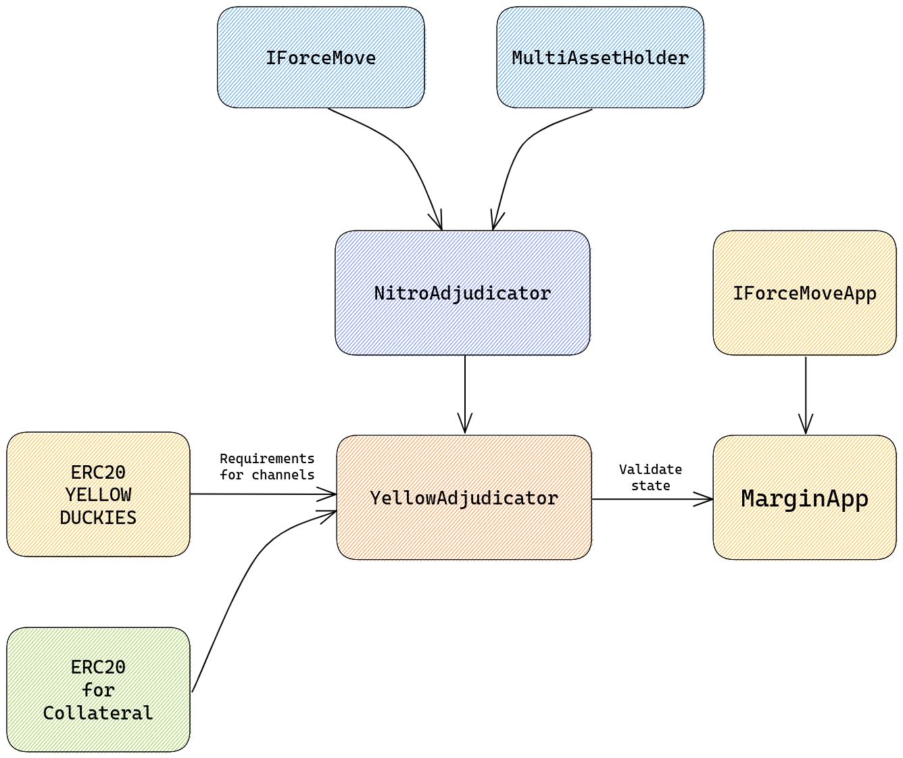

# Yellow Clearing Network

This repository contains the smart contracts of [Yellow Network](https://www.yellow.org).

Yellow Network is a Layer-3 peer-to-peer network that uses [state channels](https://statechannels.org/) technology to scale and facilitate trading, clearing and settlement. The core technology is called ClearSync.

In this system, participants of ClearSync can create and fund a state channel, which is a private communication channel between two parties that allows for off-chain transactions to occur. This means that transactions are not recorded on the main Ethereum blockchain until the channel is closed, which helps reduce congestion and increase transaction speed for high-frequency trading.

## License

[GPL-3.0](https://spdx.org/licenses/GPL-3.0-or-later.html)

ClearSync is licensed under the GNU General Public License v3.0

## Documentation

[Project Wiki](https://docs.yellow.org)

[Technical Paper](docs/whitepaper.md)

## Deployments

You can find more information about deployed smart contracts in [deployments.md](docs/deployments.md).

### Test Network

Goerli, Sepolia and other networks are used for development and test environments. The community of early adopters from Duckies platform and early supporters of Yellow Network may be invited for gorilla test sessions through [testnet.yellow.org](testnet.yellow.org)

#### Ethereum

| Contract | Address                                                                                                                         |
| -------- | ------------------------------------------------------------------------------------------------------------------------------- |
| Duckies  | `0x90b7E285ab6cf4e3A2487669dba3E339dB8a3320`[↗](https://etherscan.io/token/0x90b7E285ab6cf4e3A2487669dba3E339dB8a3320) |

#### Linea

| Contract | Address                                                                                                                         |
| -------- | ------------------------------------------------------------------------------------------------------------------------------- |
| Duckies  | `0x796000fad0d00b003b9dd8e531ba90cff39e01e0`[↗](https://lineascan.build/token/0x796000fad0d00b003b9dd8e531ba90cff39e01e0) |

#### Goerli

| Contract | Address                                                                                                                         |
| -------- | ------------------------------------------------------------------------------------------------------------------------------- |
| Duckies  | `0x4FFE87BDBa8bd5872Db30e8425CceC0Bd1a0E825`[↗](https://goerli.etherscan.io/address/0x4FFE87BDBa8bd5872Db30e8425CceC0Bd1a0E825) |

#### Sepolia

| Description              | Address                                                                                                                          |
| ------------------------ | -------------------------------------------------------------------------------------------------------------------------------- |
| YellowAdjudicator        | `0x47871f064d0b2ABf9190275C4D69f466C98fBD77`[↗](https://sepolia.etherscan.io/address/0x47871f064d0b2ABf9190275C4D69f466C98fBD77) |
| Yellow Network MarginApp | `0xa6F5563CD2D38a0c1F2D41DF7Eff7181bf3c6a7e`[↗](https://sepolia.etherscan.io/address/0xa6F5563CD2D38a0c1F2D41DF7Eff7181bf3c6a7e) |
| Yellow Networ EscrowApp  | `0xcccb67333fEefb04e85521fF0c219Cdb12539b84`[↗](https://sepolia.etherscan.io/address/0xcccb67333fEefb04e85521fF0c219Cdb12539b84) |
| Duckies                  | `0x63FD175d3215779deBA7532fC660fA0E10c18676`[↗](https://sepolia.etherscan.io/address/0x63FD175d3215779deBA7532fC660fA0E10c18676) |

#### Linea Goerli

| Description              | Address                                                                                                                            |
| ------------------------ | ---------------------------------------------------------------------------------------------------------------------------------- |
| Yellow Adjudicator       | `0xecd113352c973c769208a77aae8626f9fbf81c6e`[↗](https://goerli.lineascan.build/address/0xecd113352c973c769208a77aae8626f9fbf81c6e) |
| Yellow Network MarginApp | `0x478c6745c0fa5c83b886fc9d417e03c14371e9d2`[↗](https://goerli.lineascan.build/address/0x478c6745c0fa5c83b886fc9d417e03c14371e9d2) |
| Yellow Network EscrowApp | `0x94328be5c288Aa28185799435d87a7F5CB366B72`[↗](https://goerli.lineascan.build/address/0x94328be5c288Aa28185799435d87a7F5CB366B72) |
| Duckies                  | `0x4889C4d392DF005dEE5e3998D170Fa90F994699b`[↗](https://goerli.lineascan.build/address/0x4889C4d392DF005dEE5e3998D170Fa90F994699b) |


### ClearSync Architecture



### Project purpose

In traditional finance, clearing denotes all activities from the time a commitment is made for a transaction until it is settled. Yellow Network facilitates the scaling of trading between crypto-currency exchanges by interconnecting them through a simple clearing protocol called ClearSync.

### Business use cases

#### Inter-Exchange trading

Yellow Network has been initially created to facilitate medium-sized crypto-currency exchange to access a global liquidity network. Similarly to [ECN](https://en.wikipedia.org/wiki/Electronic_communication_network) in traditional finance but as a decentralized [mesh network](https://en.wikipedia.org/wiki/Mesh_networking).

At present, small- and medium-sized brokers face difficulty in obtaining liquidity due to the lack of clearing systems or prime brokers. As a result, these businesses often have to depend on their own market-making trading bots, that can be a costly undertaking in terms of capital pre-funding. Furthermore, moving customer deposits on third-party exchanges also carries a non-trivial settlement counter-party risk.

#### Algo-Trading Firms and Market Makers

Trading companies can leverage a global network to position their servers in the most optimal location with respect to liquidity volumes. By utilizing Yellow Network's cloud architecture, these firms can benefit from reduced infrastructure and operational costs.

Furthermore, since Yellow Network doesn't require pre-funding of traded assets, trading firms can enhance their capital efficiency and gain access to a broader range of market opportunities.

#### Day Traders

For day traders, it is possible to open a few channels at the start of the trading day and execute all their trades in bulk until they are ready to settle on-chain. This approach helps day traders optimize their capital usage by keeping their funds available for the most critical trading opportunities.

### Performance requirements

In ClearSync, all transactions occur off-chain; the decentralized clearing using state channels is able to achieve high throughput and low latency, making it a scalable and efficient solution for centralized (CeFi) and decentralized finance (DeFi) applications on the Ethereum network, but not limited by it.

ClearSync MUST be able to fund and defund channels under few minutes, it's expected that those direct channels (on-chain funded) lifespan is several weeks.

When parties are off-chains communication must be low latency and capable of high-frequency, margin request may occur several times per minutes, while proprietary trading protocol might be under 100 ms scale and capable of thousands of requests per seconds.

## Features

- Open and close trading channels
  - Deposit fee using YELLOW / DUCKIES
  - Deposit Collateral in USDT, USDC, DAI, WETH, WBTC
- Example Price feed from major providers
- Example Risk Management module
- Sending high-frequency Margin request off-chain
- Ability to request a settlement
  - Using our provided JointCustody
  - Using other HTLC and escrow smart-contracts
  - Using third party custodian
- Ability to challenge a margin state to unlock the collateral
- Canary test network using DUCKIES for fees
- Ability to blacklist stolen funds using [IBlacklist](docs/interfaces/IBlacklist.md)

## Usage

```bash
npx hardhat help
npx hardhat test
npx hardhat node
npx hardhat run scripts/deployContract.ts
```

### Canary Network

Duckies is the **canary network for Yellow**, for testing ClearSync technology in a live environment prior to deployment on mainnet. New network participant must deploy first on Canary Network before rolling out to the mainnet.

### Main Networks

The first network for YELLOW ERC20 and ClearSync system will be on Ethereum mainnet, but the system can be extended later to Layer-2, Linea, Optimism or others.

## Smart Contracts

### contracts/YellowToken.sol

This smart contract is an ERC20 used by both YELLOW and DUCKIES tokens. The YELLOW token is collateral to open a state channel with another network entity. Additionally, it is used to pay the settlement fees on the network.

### contracts/clearing

This folder contains the smart contracts for the ClearSync protocol: Adjudicator and State Channels Apps.

### contracts/nitro

This folder contains the smart contracts for the Nitro (State Channels) protocol.
