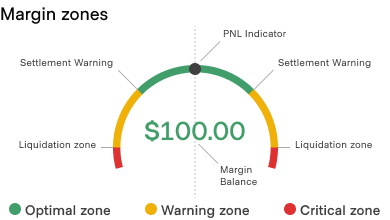

# 0006 - Margin Zones and Liquidation

## Status

Proposed

## Context

One of the main goals of a clearing channel is to increase the speed and reduce the fees of the trading process by collecting trades into batches and performing settlements on them.

However, as the trades are not settled immediately, this exposes users to the market price volatility risks, which can be mitigated by collateralizing the trades with the concept of margin.

When opening a clearing channel, participants must provide enough margin (collateral) to cover price changes of the trades they are going to perform.
Nevertheless, if the market is volatile, user's net exposure can exceed the margin provided, which is a huge security downside that the Yellow Network should mitigate.

## Decision

For the Clearport to be able to avoid undercollateralized trades, the margin should be divided into zones, and when transitioned to, each zone should trigger a special action.

### Margin zones

- **Green** (Operational) zone (default) - the margin distribution is enough for both parties to cover possible price changes that they have performed.
- **Orange** (Warning) zone - the margin distribution shifts the bigger part of a margin for one party, meaning the other one can become undercollaterallized if the market moves against them.
  When the margin transitions to the _orange_ zone*, users can no longer create trades (except for counter-trades to close the position and lock its PnL) and are advised to perform settlement to move margin to a \_green zone*.
  Note, that parties can select what markets to settle themselves, however, the resulting margin distribution should be in the green zone.
- **Red** (Critical) zone - the margin is almost depleted for one of the parties, meaning if the market continues to move against them, they will become undercollaterallized soon.
  When the margin transitions to the _red zone_, the Clearport initiates liquidation of the positions (order and strategy is up to Clearport) to move the margin to the green zone.

#### Margin zones limits

When described in a context of one party, margin zone limits are represented as a percentage of their margin, e.g. green zone is 100% - 20%, orange zone is 20% - 10%, and red zone is 10% - 0%.

Red-orange limit can also be called **Maintenance Margin Rate (MMR)** .

"Channel margin is not in a green zone" means that margin for one of participants is not in a green zone, and this participant should be specified, e.g. `Alice [88, 12] Bob` means that margin is in orange zone for Bob (given zone limits above).

This proposal suggests to specify margin zone limits to be the following:

- Red-orange (MMR) - 10%
- Orange-Green - 20% (2 x MMR)

A visual example for a better understanding:

#### Liquidation

Liquidation is a process of closing the positions of the undercollaterallized party to move the margin to the green zone.

This proposal does not define an algorithm for Clearport to select positions to liquidate, but it can be one of the following:

- **Liquidate all** - the Clearport selects all positions for the liquidation. The resulting margin distribution is 50/50.
- **Move to center with the least amount of most impactful** - the Clearport selects the least amount of the positions with the highest net impact, such that after liquidation margin would be the closest to 50/50.
- **Move to green with the least amount of most impactful** - alike the previous, Clearport stops liquidating positions once the margin enters the green zone.

> The difference between the last two is that the _"Move to green ..."_ changes the margin distribution less. For example, before the liquidation the margin distribution was `[93, 7]` with the green zone at 15 and higher,
> the _"Move to center ..."_ positions selection algorithm can change the margin to be `[52, 48]`, and the _"Move to green ..."_ to `[83, 17]`.

## Consequences

1. Margin zone limits shall be defined in the application configuration.
2. Clearport shall notify other components that the margin zone has changed.
3. Clearport shall disallow adding new trades (except for counter-trades) if the margin is in the orange or red zone.
4. Clearport shall initiate liquidation if the margin is in the red zone.
5. Clearport shall implement at least one, and should implement several position selection algorithm for liquidation, which may be one of the described in this document or a custom one(s).
