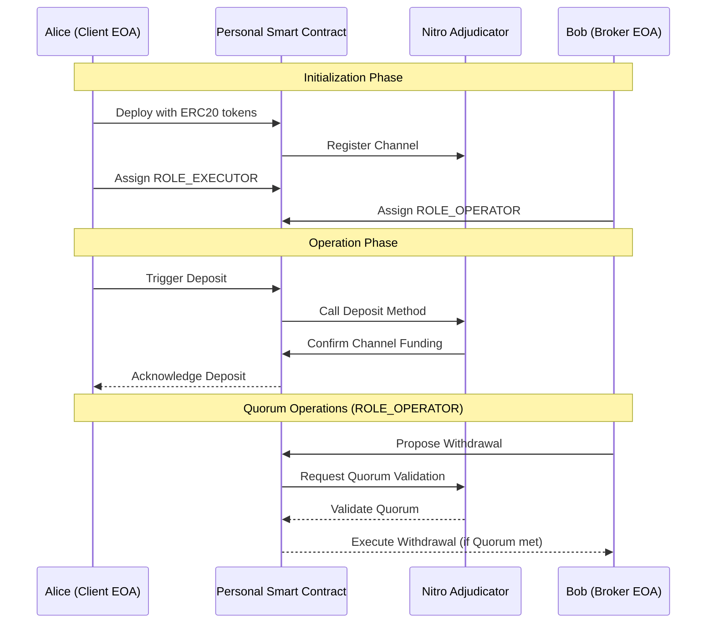

# YIP-0010: Enhanced Smart Contract-Based Channel Funding

## Abstract
YIP-0010 outlines an advanced smart contract system for the funding and defunding of state channels on the Yellow Network's Nitro Adjudicator. This system employs personal smart contracts to manage multiple ERC20 tokens for triggering channel funding operations. The contract integrates role-based access control and quorum management for enhanced security and flexibility.

## Motivation
The proposal aims to provide a more versatile and secure mechanism for funding state channels. By allowing the handling of multiple ERC20 tokens and integrating robust control features, users are offered a seamless and secure experience in managing their funds within the network.

## Specification



### Smart Contract Roles
The smart contract incorporates two primary roles:

1. **ROLE_EXECUTOR**: 
   - Authorized to directly call methods like `deposit`, `conclude`, and `challenge` on the adjudicator without a quorum requirement.

2. **ROLE_OPERATOR**: 
   - Governed by a quorum mechanism, as defined in the attached `Quorum.sol` file.
   - Empowered to manage the quorum rules and execute fund withdrawals from custody.

### Contract Methods

- **Deposit Method**: 
  - Accepts an array of ERC20 tokens and respective amounts for deposit.
  - Invokes the `Deposit` method on the adjudicator, effectively funding the channel with multiple token types.

### Contract Inheritance
The contract will inherit from both `AccessControl` and `Quorum` for enhanced access control and quorum management capabilities.

### Example Solidity Code
Here is a revised Solidity code snippet for the personal smart contract:

```solidity
pragma solidity ^0.8.0;

import "@openzeppelin/contracts/access/AccessControl.sol";
import "./Quorum.sol";
import "./IMultiAssetHolder.sol";

contract ChannelFundingCustody is AccessControl, Quorum {
    bytes32 public constant ROLE_EXECUTOR = keccak256("ROLE_EXECUTOR");
    bytes32 public constant ROLE_OPERATOR = keccak256("ROLE_OPERATOR");
    IMultiAssetHolder public adjudicator;

    constructor(address _adjudicatorAddress) {
        adjudicator = IMultiAssetHolder(_adjudicatorAddress);
        _setupRole(DEFAULT_ADMIN_ROLE, msg.sender);
    }

    function deposit(
        bytes32 channelId, 
        address[] calldata tokenAddresses, 
        uint256[] calldata amounts
    ) external onlyRole(ROLE_EXECUTOR) {
        require(tokenAddresses.length == amounts.length, "Array length mismatch");
        for (uint i = 0; i < tokenAddresses.length; i++) {
            // Code to transfer ERC20 tokens to adjudicator for channel funding
            adjudicator.deposit(channelId, tokenAddresses[i], amounts[i]);
        }
    }

    // Additional methods for conclude, challenge, and quorum management
}
```

## Rationale
The ability to handle multiple ERC20 tokens for channel funding and defunding adds significant flexibility for users. The integration of a quorum mechanism under the ROLE_OPERATOR ensures a higher degree of security and control, especially for operations involving substantial funds or critical channel operations.

## Security Considerations
- Rigorous testing and auditing of the smart contract, especially the quorum-related functionalities, are crucial.
- Careful management of roles and permissions is necessary to prevent unauthorized operations.

## Conclusion
YIP-0010 presents a comprehensive solution for managing state channel funding in the Yellow Network, enhancing the functionality with multi-token support and sophisticated access control mechanisms. This proposal aims to improve the security, efficiency, and user experience in the network's decentralized clearing system.
