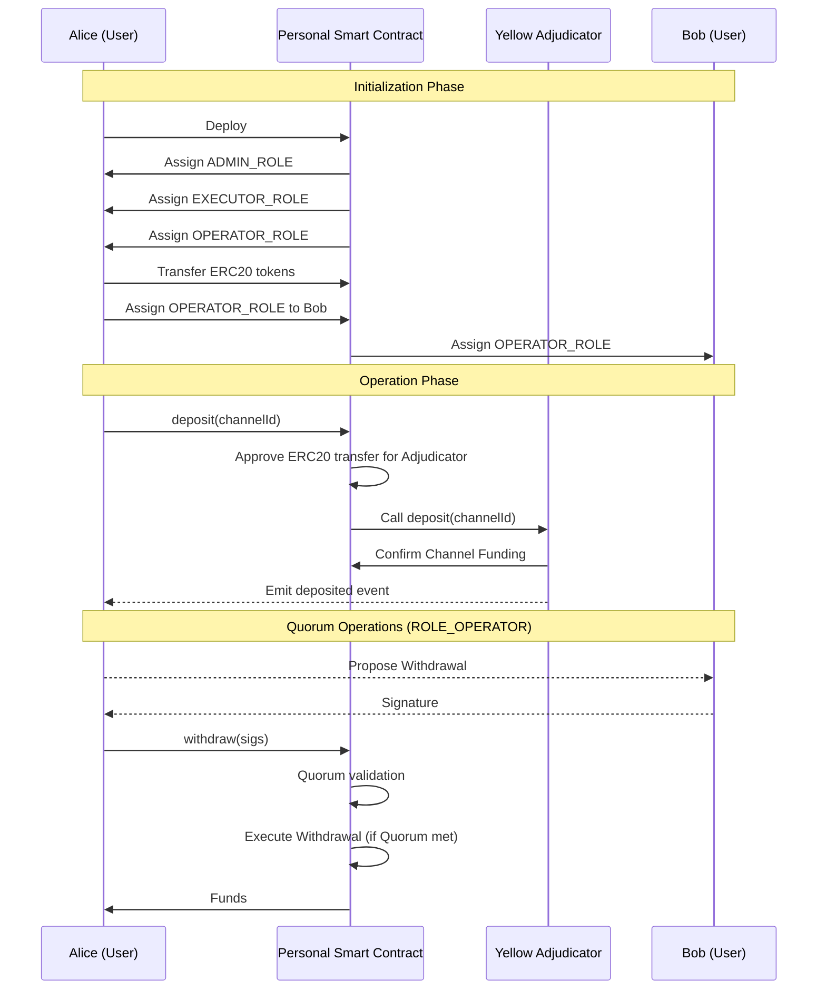

# YIP-0010: Enhanced Smart Contract-Based Channel Funding

## Status

Proposed

## Context

Currently, the channel is funded using an EOA (Externally Owned Account) to directly call the `deposit` method on the Adjudicator. This method only supports the funding of a single ERC20 token at a time.
Moreover, internally the Adjudicator calls `transferFrom` on the ERC20 token contract to transfer the funds from the EOA to the Adjudicator. This means that the EOA must have approved the Adjudicator to spend the ERC20 tokens on its behalf.
Furthermore, the EOA is required to have sufficient ETH to pay for the gas fees.

Thus, to fund a channel, the user must have sufficient native token balance to pay for the gas fees and to sign and submit 2 transactions per ERC20 token to deposit.
This means that to fund an escrow channel to settle 20 ERC20 tokens, the user must sign and submit 40 transactions, which is a very cumbersome and not user-friendly process.

## Decision

### Abstract

YIP-0010 outlines an advanced smart contract system for the funding and defunding of state channels on the Yellow Network's Nitro Adjudicator. This system employs personal smart contracts to manage multiple ERC20 tokens for triggering channel funding operations.
The contract integrates role-based access control and quorum management for enhanced security and flexibility.

### Motivation

The proposal aims to provide a more versatile and secure mechanism for funding state channels. By allowing the handling of multiple ERC20 tokens and integrating robust control features,
users are offered a seamless and secure experience in managing their funds within the network.

### Functionality

This proposal introduces a new smart contract-based mechanism for channel funding and operations. The system is based on the `ChannelOpsVault` contract, which is deployed by each user of the network to manage their channels.

The following functionality is provided by `ChannelOpsVault`:

- **Channel funding**

  As to optimize the cost of funding channels and to decrease the number of transactions a user has to perform, the `ChannelOpsVault` contract has to store user funds and use them to fund channels.

- **Channel defunding**

  When the channel is defunded, the funds can be returned straight to the `ChannelOpsVault` contract, and later be used to fund other channels.

- **Role-based adjudicator interaction**

  Only trusted parties are able to operate the Adjudicator with the funds stored.

- **Quorum-based withdrawal**

  Only a quorum-approved withdrawal can be executed.

- **Social recovery**

  In case of `ChannelOpsVault` admin private key loss, the administrative rights can be transferred to a new account given a quorum of trusted parties agrees to do so.

For the functionality described the contract must provide a high level of security, which is achieved by using the _role-based access control_ mechanism and a _quorum-based fund withdrawal_ mechanism.

### Role-based access control

The **role-based access control** insures that only trusted parties are able to operate the Adjudicator with the funds stored in the `ChannelOpsVault` contract.

The smart contracts incorporates 3 primary roles:

- **ADMIN_ROLE**:

  - Authorized to grant and revoke other roles.
  - Assigned to the account which deployed the `ChannelOpsVault` contract.

- **ROLE_EXECUTOR**:

  - Authorized to operate the Adjudicator with the funds stored in the `ChannelOpsVault` contract.
  - Assigned to the account which deployed the `ChannelOpsVault` contract.

- **ROLE_OPERATOR**:

  - Authorized to withdraw funds from the `ChannelOpsVault` contract.
  - Empowered to manage the quorum rules.
  - Governed by a quorum mechanism.
  - Assigned to the account which deployed the `ChannelOpsVault` contract.

### Quorum system

The **quorum-based fund withdrawal** mechanism insures that the funds stored in the `ChannelOpsVault` contract can only be withdrawn if a quorum of trusted parties agrees to do so.
This way, if a malicious party gains access to an account with `ROLE_WITHDRAWER` and initiates a fund withdrawal, a quorum is able to prevent the withdrawal and protect the funds.

Moreover, a _social recovery_ feature can be implemented in the `ChannelOpsVault` contract, which in case of `ADMIN_ROLE` private key loss allows to transfer the `ADMIN_ROLE` to a new account given a quorum of trusted parties agrees to do so.

Therefore, the `ChannelOpsVault` plays a role of a secure multisig wallet for channel operations, while keeping the user wallet with underlying EOA security vulnerabilities to themselves.

### Transaction number optimization

#### Current Adjudicator implementation funding

In the current implementation, the user has to sign and submit 2 transactions per ERC20 token to fund a channel. The first transaction is to approve the Adjudicator to spend the ERC20 tokens on the user's behalf, and the second transaction is to call the `deposit` method on the Adjudicator with the ERC20.

```ts
// Number of transactions to fund a channel directly from the wallet
const txNum = numOfTokens * 2; // (1 approve + 1 deposit) per token
```

#### Possible Adjudicator optimization

Nevertheless, current Adjudicator implementation can be optimized to allow for a single deposit transaction to fund multiple ERC20 tokens. This way, the user firstly needs to approve the Adjudicator to spend the ERC20 tokens on their behalf, and then call the `deposit` method on the Adjudicator to fund the channel.

```ts
// Number of transactions to fund a channel directly from the wallet with optimized Adjudicator
const txNum = numOfTokens + 1; // (1 approve) per token + 1 adjudicator.deposit
```

#### `ChannelOpsVault` funding

The `ChannelOpsVault` contract allows to decrease the number of transactions a user has to perform to fund a channel. As user funds are stored in the contract, for each channel funding the `ChannelOpsVault` can internally
increase the allowance for every token the channel is funded with, and then call the `deposit` method on the Adjudicator. This way, the user only has to sign and submit 1 transaction per ERC20 token to fund a channel.

However, to begin operating the `ChannelOpsVault` contract, the user must first deposit funds to the contract. This can be done by calling the `deposit` method on the contract, which will transfer the funds from the user wallet to the `ChannelOpsVault` contract.

```ts
// Number of transactions to fund a channel via `ChannelOpsVault` contract
const txNum = numOfTokens + 1; // (1 ERC20.transfer) for each token + 1 adjudicator.deposit
```

Thus, if a user wants to open only one channel, defund it and don't use the network anymore, the number of transactions they have to perform is the same as if they were to fund the channel directly from their wallet.

However, if a user wants to open several channels (consecutively or simultaneously), the number of transactions they have to perform is significantly decreased.

#### Example comparison

Let's compare the number of transactions a user has to perform to fund and defuze 2 clearing channels (with 2 tokens) with 2 settlements each (with 5 tokens, fund and defund).

The table shows the sum of number of transactions a user had performed for this and previous operations, with a number of transactions required for the operation in the current row shown in parentheses.
It is assumed that the user deposits enough funds to the `ChannelOpsVault` contract to fund all channels and settlements.

| Operation                     | Current Adjudicator | Optimized Adjudicator | `ChannelOpsVault` |
| ----------------------------- | ------------------- | --------------------- | ----------------- |
| Setup                         | 0                   | 0                     | 7                 |
| 1st Clearing channel deposit  | 4 (+4)              | 3 (+3)                | 8 (+1)            |
| 1st Settlement deposit        | 14 (+10)            | 9 (+6)                | 9 (+1)            |
| 1st Settlement withdraw       | 15 (+1)             | 10 (+1)               | 10 (+1)           |
| 2nd Settlement deposit        | 25 (+10)            | 16 (+6)               | 11 (+1)           |
| 2nd Settlement withdraw       | 26 (+1)             | 17 (+1)               | 12 (+1)           |
| 1st Clearing channel withdraw | 27 (+1)             | 18 (+1)               | 13 (+1)           |
| 2nd Clearing channel deposit  | 31 (+4)             | 21 (+3)               | 14 (+1)           |
| 1st Settlement deposit        | 41 (+10)            | 26 (+6)               | 15 (+1)           |
| 1st Settlement withdraw       | 42 (+1)             | 27 (+1)               | 16 (+1)           |
| 2nd Settlement deposit        | 52 (+10)            | 32 (+6)               | 17 (+1)           |
| 2nd Settlement withdraw       | 53 (+1)             | 33 (+1)               | 18 (+1)           |
| 2nd Clearing channel withdraw | 54 (+1)             | 34 (+1)               | 19 (+1)           |

As can be seen from the table, the number of transactions a user has to perform is significantly decreased when using the `ChannelOpsVault` contract.

### Automation with service accounts

Described `ChannelOpsVault` logic and usage suits the average user well, but makes all processes for the Brokers manual.
To automate the process of channel funding, defunding and other Adjudicator operations, the `ChannelOpsVault` contract can be used in conjunction with a service account.

The service account (SA) is an EOA with enough native token to pay for gas fees (basically, a gas tank), that is used by the Clearport to perform all Adjudicator operations.
This proposal does not specify how the SA is created, however the Broker shall have full control over it.

Therefore, to automate the channel operations, the Broker has to deploy the `ChannelOpsVault` contract, transfer funds to it, fund the SA account and then grant the `ROLE_EXECUTOR` role to the SA.

### Sequence Diagram



## Consequences

This proposal introduces a `ChannelOpsVault` contract as another transaction execution method, which allows to decrease the number of transactions a user has to perform to fund a channel.

The `ChannelOpsVault`:

- shall implement a role-based access control mechanism
- shall implement a quorum-based fund withdrawal mechanism
- can implement a social recovery mechanism
- can be used in conjunction with a service account to automate the channel operations
- shall implement channel operations (funding, defunding, etc.)
- shall internally increase allowance for ERC20 tokens it owns at each channel funding

### Impact on regular users

While decreasing the number of transactions needed to fund a channel for regular user, who open several consecutive or simultaneous channels, the `ChannelOpsVault` contract adds
an extra step and complexity to the channel funding process to one-time users, who are only interested in opening a single channel.

Therefore, it would be wise to allow users to select the channel funding method they prefer (EOA wallet or via `ChannelOpsVault`).
