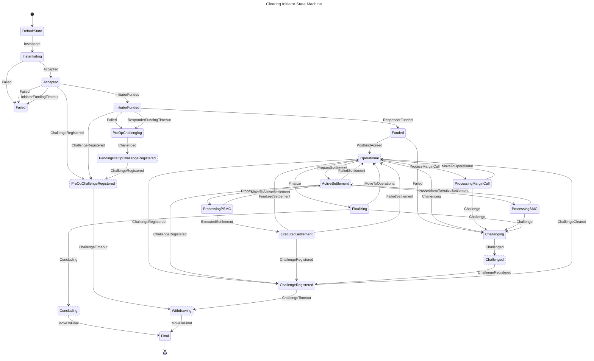
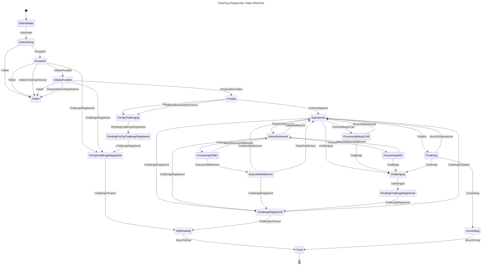

# 00011 - Clearing State Machine

## Status

Proposed

## Context

Clearing process is becoming more and more complex as the protocol evolves. The clearing state machine (CSM) is a good candidate to encapsulate the logic of the clearing process and to make sure that all the possible events of the clearing process are handled.

## Decision

Create a state machine that handles the clearing process using [YIP 0010 - State machine framework](./YIP-0010-state-machine-framework.md).
There are two state machines, one for the initiator and one for the responder. The state machines are almost identical, but there are some differences in the actions that are executed and in the transitions.

### Vocabulary and abbreviations

**PSMC** - Post Settlement Margin Call

**SMC** - Settlement Margin Call

**SSM** - Settlement State Machine

### Initiator CSM diagram

### Responder CSM diagram

### States

#### DefaultState

Default clearing state, that sets only on state machine creation

##### Action

No action

##### Transitions

| Event       | State         | Description                                                                                                                 |
|-------------|---------------|-----------------------------------------------------------------------------------------------------------------------------|
| Instantiate | Instantiating | External event that starts clearing process. Should be emitted only after creation of ClearStream inside persistent storage |

#### Instantiating

The first state of active clearing process, mostly focused on validation and issuing prefund state

##### Initiator Action

1. Updates state in Storage
2. Notifies user about state update
3. Checks for sufficient requirements for channel opening
4. Issues prefund nitro state

##### Responder Action

1. Updates state in Storage
2. Notifies user about state update
3. Checks for sufficient requirements for channel opening
4. Countersigns prefund nitro state

##### Transitions

| Event    | State    | Description                                                          |
|----------|----------|----------------------------------------------------------------------|
| Accepted | Accepted | Internal event that continues clearing process                       |
| Failed   | Failed   | Internal event that could occur on any error during action execution |

#### Failed

One of possible final states, occurs only before funds were deposited on any error that happened

##### Action

1. Updates state in Storage
2. Notifies user about state update

##### Transitions

No transitions

#### Accepted

Indicates that peers agreed on prefund nitro state and channel is ready for funding

##### Initiator Action

1. Updates state in Storage
2. Notifies user about state update
3. Launches `InitiatorFundingTimeout` timer
4. Funds (if auto fund is ON)

##### Responder Action

1. Updates state in Storage
2. Notifies user about state update
3. Launches `InitiatorFundingTimeout` timer

##### Transitions

| Event                   | State                             | Description                                                                                                                           |
|-------------------------|-----------------------------------|---------------------------------------------------------------------------------------------------------------------------------------|
| InitiatorFunded         | InitiatorFunded                   | External event that indicates that Initiator fulfilled his part of the deal by funding channel                                        |
| Failed                  | Failed                            | Internal event that could occur on any error during action execution                                                                  |
| InitiatorFundingTimeout | Failed                            | External event that indicates that Initiator haven't fulfilled his part of the deal on time, so there is no need to keep channel open |
| ChallengeRegistered     | PreOpChallengeRegistered | External event that indicates Challenge was started on blockchain                                                                     |

#### InitiatorFunded

Indicates that Initiator funded channel, and now it's Responder's turn

##### Initiator Action

1. Updates state in Storage
2. Notifies user about state update
3. Removes `InitiatorFundingTimeout` timer
4. Launches `ResponderFundingTimeout` timer

##### Responder Action

1. Updates state in Storage
2. Notifies user about state update
3. Removes `InitiatorFundingTimeout` timer
4. Funds (if auto fund is ON)
5. Launches `NoPostfundTimeout` timer

##### Transitions

| Side | Event                   | State                             | Description                                                                                                                                      |
|------|-------------------------|-----------------------------------|--------------------------------------------------------------------------------------------------------------------------------------------------|
| IR   | ResponderFunded         | Funded                            | External event that indicates that Responder fulfilled his part of the deal by funding channel                                                   |
| I    | Failed                  | PreOpChallenging         | Internal event that could occur on any error during action execution, so Initiator calls Challenge to retrieve his assets                        |
| R    | Failed                  | Failed                            | Internal event that could occur on any error during action execution                                                                             |
| I    | ResponderFundingTimeout | PreOpChallenging         | External event that indicates that Responder haven't fulfilled his part of the deal on time, so Initiator calls Challenge to retrieve his assets |
| R    | ResponderFundingTimeout | Failed                            | External event that indicates that Responder haven't fulfilled his part of the deal on time                                                      |
| IR   | ChallengeRegistered     | PreOpChallengeRegistered | External event that indicates Challenge was started on blockchain                                                                                |

#### PreOpChallenging

Indicates the will of one party to forcefully close the channel before Postfund was sign

##### Action

1. Updates state in Storage
2. Notifies user about state update
3. Removes `ResponderFundingTimeout` timer
4. Starts Challenge with Prefund State

##### Transitions

| Event      | State                    | Description                                                            |
|------------|--------------------------|------------------------------------------------------------------------|
| Challenged | PendingPreOpChallengeRegistered | Internal event that indicates that Peer successfully started challenge |

#### PendingPreOpChallengeRegistered

There is active challenge, that was called before postfund was signed

##### Action

1. Updates state in Storage
2. Notifies user about state update

##### Transitions

| Event               | State                             | Description                                                               |
|---------------------|-----------------------------------|---------------------------------------------------------------------------|
| ChallengeRegistered | PreOpChallengeRegistered | External event that indicates that Challenge was registered on blockchain |

#### PreOpChallengeRegistered

There is challenge, that was registered on blockchain before postfund was signed

NOTE: Since only one state was signed, this type of Challenge cannot be cleared and will timeout whatsoever

##### Action

1. Updates state in Storage
2. Notifies user about state update
3. Starts `ChallengeTimeout` timer

##### Transitions

| Event            | State           | Description                                                                                          |
|------------------|-----------------|------------------------------------------------------------------------------------------------------|
| ChallengeTimeout | Withdrawing | External event that indicates that Challenge timeout expired and now channel is ready to be defunded |

#### Funded

Clearing channel was funded by both sides and now it's time to sign postfund

NOTE: there are two types of errors: ones that happened before issuing postfund state
and after. In the first case we could transition to `PreOpChallenging`, but
in the second case Responder could clear timeout with postfund state, so only one possible transition
to the `Challenging` state is possible

##### Initiator Action

1. Updates state in Storage
2. Notifies user about state update
3. Removes `ResponderFundingTimeout` timer
4. Issues postfund nitro state
5. Notifies user about successful channel opening

##### Responder Action

1. Updates state in Storage
2. Notifies user about state update
3. Removes `NoPostfundTimeout` timer
4. Countersigns postfund nitro state
5. Notifies user about successful channel opening

##### Transitions

| Event            | State       | Description                                                                   |
|------------------|-------------|-------------------------------------------------------------------------------|
| PostfundAgreed | Operational | Internal event that indicates that postfund was successfully signed and saved |
| Failed           | Challenging | Internal event that could occur on any error during action execution          |

#### Operational

Clearing channel has no other tasks, but existing

##### Initiator Action

1. Updates state in Storage

##### Responder Action

1. Updates state in Storage
2. Launches `NoMarginCallsTimeout` timer

##### Transitions

| Event               | State                | Description                                                                                                |
|---------------------|----------------------|------------------------------------------------------------------------------------------------------------|
| PrepareSettlement   | ActiveSettlement     | External event that comes from the settlement state machine, indicates that settlement process was started |
| Finalize            | Finalizing           | External event that comes from the user request to gracefully close the clearing channel                   |
| ProcessMarginCall   | ProcessingMarginCall | External event that comes from the reactor(?) system and intending to issue new margin call                |
| Challenging         | Challenging          | External event that request to forcefully close the clearing channel                                       |
| ChallengeRegistered | ChallengeRegistered  | External event that indicates that Challenge was started on blockchain                                     |

#### ProcessingMarginCall

Clearing channel is processing new margin call (aka nitro state). For the Initiator it
means that he should issue new state, for the Responder -- that he should countresign it

##### Initiator Action

1. Issues nitro state update
2. Checks and updates `StateSyncFailure` amount

##### Responder Action

1. Validates nitro state
2. Countersigns nitro state update
3. Removes `NoMarginCallsTimeout` timer
4. Checks and updates `StateSyncFailure` amount  

##### Transitions

| Event             | State       | Description                                                                                                            |
|-------------------|-------------|------------------------------------------------------------------------------------------------------------------------|
| MoveToOperational | Operational | Internal event that indicates that margin call was agreed or refused but `StateSyncFailure` amount is still acceptable |
| Challenging       | Challenging | Internal event that indicates that margin call was refused and `StateSyncFailure` amount is unacceptable               |

#### ActiveSettlement

Clearing process is currently in the middle of settlement, but `PostSettlementState` wasn't signed yet

##### Initiator Action

1. Updates state in Storage
2. Notifies user about state update
3. If something went wrong -- notifies SSM about failure

##### Responder Action

1. Updates state in Storage
2. Notifies user about state update
3. Removes `NoMarginCallsTimeout` timer
4. If something went wrong -- notifies SSM about failure

##### Transitions

| Event               | State               | Description                                                                                                                 |
|---------------------|---------------------|-----------------------------------------------------------------------------------------------------------------------------|
| ProcessPSMC         | ProcessingPSMC      | External event from the SSM that indicates that it's time to stop processing margin calls                                   |
| ProcessMarginCall   | ProcessingSMC       | External event from the reactor(?) system and intending to issue new margin call                                            |
| FailedSettlement    | Operational         | External event from the SSM that indicates that Settlement Failed for some reason and CSM could return to Operational state |
| ChallengeRegistered | ChallengeRegistered | External event that indicates that Challenge was started on blockchain                                                      |

#### ProcessingSMC

Clearing channel is processing new margin call (aka nitro state) and processing settlement simultaneously

##### Action

1. Issues nitro state update
2. Checks and updates `StateSyncFailure` amount
3. In case of `Challenge` notifies SSM about failure

##### Responder Action

1. Validates nitro state
2. Countersigns nitro state update
3. Removes `NoMarginCallsTimeout` timer
4. Checks and updates `StateSyncFailure` amount

##### Transitions

| Event                  | State            | Description                                                                                                            |
|------------------------|------------------|------------------------------------------------------------------------------------------------------------------------|
| MoveToActiveSettlement | ActiveSettlement | Internal event that indicates that margin call was agreed or refused but `StateSyncFailure` amount is still acceptable |
| Challenging            | Challenging      | Internal event that indicates that margin call was refused and `StateSyncFailure` amount is unacceptable               |

#### ProcessingPSMC

Clearing channel is processing new margin call (aka nitro state) and processing settlement simultaneously

##### Initiator Action

1. Updates state in Storage
2. Issues nitro state with PSMC turn number
3. In case of failure notifies SSM about it

##### Initiator Action

1. Updates state in Storage
2. Validates nitro state with PSMC turn number
3. Countersigns nitro state with PSMC turn number
4. Removes `NoMarginCallsTimeout` timer
5. In case of failure notifies SSM about it

##### Transitions

| Event                  | State              | Description                                                                                                              |
|------------------------|--------------------|--------------------------------------------------------------------------------------------------------------------------|
| ExecutedSettlement     | ExecutedSettlement | Internal event that indicates that PSMC was agreed                                                                       |
| MoveToActiveSettlement | ActiveSettlement   | Internal event that indicates that PSMC was refused or some other error happened, so it moves back to `ActiveSettlement` |

#### ExecutedSettlement

PSMC was signed, so it's time to wait for the settlement finalization. In this case we
cannot process new margin calls until settlement will finalize

##### Action

1. Updates state in Storage
2. Notifies user about state update
3. Notifies SSM about successful PSMC sign

##### Transitions

| Event               | State               | Description                                                            |
|---------------------|---------------------|------------------------------------------------------------------------|
| FinalizedSettlement | Operational         | External event from the SSM that indicates that settlement failed      |
| FailedSettlement    | Operational         | External event from the SSM that indicates that settlement succeed     |
| ChallengeRegistered | ChallengeRegistered | External event that indicates that Challenge was started on blockchain |

#### Challenging

Indicates the will of one party to forcefully close the channel

##### Action

1. Updates state in Storage
2. Notifies user about state update
4. Starts Challenge with Last Supported State

##### Transitions

| Event      | State      | Description                                                            |
|------------|------------|------------------------------------------------------------------------|
| Challenged | PendingChallengeRegistered | Internal event that indicates that Peer successfully started challenge |

#### PendingChallengeRegistered

There is active challenge

##### Action

1. Updates state in Storage
2. Notifies user about state update

##### Transitions

| Event               | State               | Description                                                               |
|---------------------|---------------------|---------------------------------------------------------------------------|
| ChallengeRegistered | ChallengeRegistered | External event that indicates that Challenge was registered on blockchain |

#### ChallengeRegistered

There is challenge, that was registered on blockchain

##### Action

1. Updates state in Storage
2. Notifies user about state update
3. Starts `ChallengeTimeout` timer

##### Transitions

| Event            | State           | Description                                                                                          |
|------------------|-----------------|------------------------------------------------------------------------------------------------------|
| ChallengeCleared | Operational     | External event that Challenge was cleared on blockchain and now it could return back to operational  |
| ChallengeTimeout | Withdrawing | External event that indicates that Challenge timeout expired and now channel is ready to be defunded |

#### Finalizing

Processes final clearing state

##### Initiator Action

1. Updates state in Storage
2. Notifies user about state update
3. Issues final clearing state
4. Checks and updates `StateSyncFailure` amount

##### Responder Action

1. Updates state in Storage
2. Notifies user about state update
3. Removes `NoMarginCallsTimeout` timer
4. Validates final clearing state
5. Countersigns final clearing state
6. Checks and updates `StateSyncFailure` amount
7. Calls `ConcludeAndWithdraw` method on blockchain

##### Transitions

| Event               | State               | Description                                                                                         |
|---------------------|---------------------|-----------------------------------------------------------------------------------------------------|
| Concluding     | Concluding     | Internal event that indicates that final state was successfully signed                              |
| Challenge           | Challenging         | Internal event that indicates that final state wasn't signed and `StateSyncFailure` is unacceptable |
| MoveToOperational   | Operational         | Internal event that indicates that final state wasn't signed and `StateSyncFailure` is acceptable   |

#### Concluding

Waits for the event from the blockchain about concluding channel

##### Action

1. Updates state in Storage
2. Notifies user about state update

##### Transitions

| Event       | State | Description                                                                               |
|-------------|-------|-------------------------------------------------------------------------------------------|
| MoveToFinal | Final | External event from reactor system that indicates that channel was successfully concluded |

#### Withdrawing

Waits for the event from the blockchain about defunding channel

##### Action

1. Updates state in Storage
2. Notifies user about state update

##### Transitions

| Event       | State | Description                                                                               |
|-------------|-------|-------------------------------------------------------------------------------------------|
| MoveToFinal | Final | External event from reactor system that indicates that channel was successfully withdrawn |

#### Final

Clearing channel was closed and defunded. GZ

##### Action

1. Updates state in Storage
2. Notifies user about state update

##### Transitions

No transitions

### Questions to resolve

1. Before signing postfund we have `Failed` events, which occurs on any error that happens during the Action execution.
   I(M) suggest using *some kind of retry thing* that will try to perform Action fixed amount of time (5) and only then
   system will give up and emit Failed event

2. At any moment of clearing we could receive event about Challenge from counterparty side.
   Malicious Challenges (turn num < last signed turn num) could be handled without state machine

   BUT we may somehow handle Challenge spam, e.g. my peer sended me 5 malicious challenges in last
   10 minutes -- the guy is crazy and I want to close the deal

   BUT (x2) non-malicious challenges (turn num == last signed turn num) should change state of clearing SM

   BUT (x3) we could reuse corresponding `...Challenged` state, and it will look relatively nice

   M: Is it hell to handle? Hell, yeah

3. If during `PreOpChallenging` or `Challenging` (actually it could be applied to any *failed* case)
   something goes, when cannot do anything. There are some cases what we could possibly do,
   but I (M) suggest method: retry and panic

4. During `ProcessingMarginCall` state we may not save the state because it's useless for the recovery,
   it may look like call of the function thought the state machine and not a state, but it will be so
   much easier to synchronize our system if we will accept it as a state machine state. I(M)'d called it
   `in-memory-state`.

5. During `ActiveSettlement` we notify user about settlement start, but probably we will notify about it from
   the settlement sm as well. It's a tiny UI/UX thing but still.

6. `ActiveSettlement` and `ExecutedSettlement` -- This state hardly depends on settlement state machine, either settlement will succeed or it will fail
   SSM should return state of clearing state machine back to operational. But for some reason it could not happen and CSM will stuck
   We could add `NonOperationalTimeout`, that will return system back to `Operational` no matter what. but we don't know about time
   limits, it could be 1 minute, 1 hour or even 1 day

7. During `Funded` state we could come across situation when Initiator issues postfund, Responder receives it and signs,
   but keeps it to himself. Initiator decides to clear challenge with prefund state and Responder clears challenge with postfunded
   state. At this case we need to retrieve postfund state from the blockchain

8. `ExecutedSettlement` -- need to think more about edge cases.

9. Add `Rejected` event

10. Do we need `InitiatorFundingTimeout` on `Initiator` side and `ResponderFundingTimeout` on `Responder` side?

11. Responder should withdraw from channel in case of Challenge. But there is no suitable state for it.
    In theory we could do that inside reactor, but it feels like a hack. Maybe we should add `Withdraw` state
    + what about auto defunding?

12. What to do with Challenge during Settlement or what to do with Settlement during Challenge?

## Consequences

TODO
