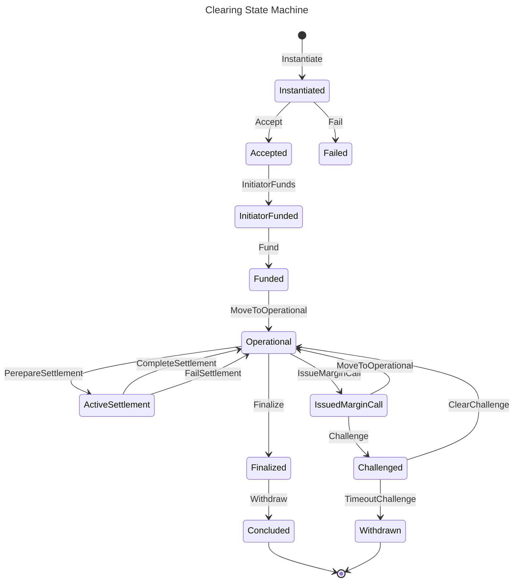

# 00011 - Clearing State Machine

## Status

Proposed

## Context

Clearing process become more and more complex as the protocol evolves. The clearing state machine (CSM) is a good candidate to encapsulate the logic of the clearing process. And make sure that we handle (or reject to handle) all the possible events of the clearing process.

## Decision

Create a state machine that handles the clearing process using prepared framework.

### CSM diagram

## Consequences

TODO
