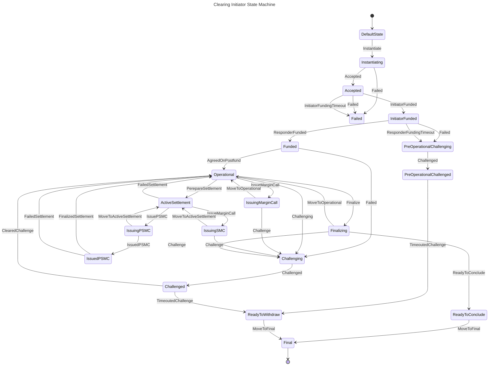

# 00011 - Clearing State Machine

## Status

Proposed

## Context

Clearing process become more and more complex as the protocol evolves. The clearing state machine (CSM) is a good candidate to encapsulate the logic of the clearing process. And make sure that we handle (or reject to handle) all the possible events of the clearing process.

## Decision

Create a state machine that handles the clearing process using prepared framework.

NOTE: PSMC stands for Post Settlement Margin Call

NOTE: SMC stands for Settlement Margin Call

NOTE: SSM stands for Settlement State Machine

### CSM diagram

### States

#### DefaultState

Default clearing state, that sets only on state machine creation

##### Action

No action

##### Transitions

| Event       | State         | Description                                                                                                              |
|-------------|---------------|--------------------------------------------------------------------------------------------------------------------------|
| Instantiate | Instantiating | External call that starts clearing process. Should be call only after creation of ClearStream inside persistence storage |                                                                                                                      |   |   |

#### Instantiating

The first state of active clearing process, mostly focused on validation and issuing prefund state

##### Action

1. Updates state in Storage
2. Notifies user about state update
3. Checks for sufficient requirements for channel openning
4. Issues prefund nitro state

##### Transitions

| Event    | State    | Description                                                         |
|----------|----------|---------------------------------------------------------------------|
| Accepted | Accepted | Internal call that continues clearing process                       |
| Failed   | Failed   | Internal call that could occur on any error during action execution |

#### Failed

One of possible final states, occurs only before funds were deposited on any error that happend

##### Action

1. Updates state in Storage
2. Notifies user about state update

##### Transitions

No transitions

#### Accepted

Indicates that peers agreed on prefund nitro state and channel is ready for funding

##### Action

1. Updates state in Storage
2. Notifies user about state update
3. Launch `InitiatorFundingTimeout` timer

##### Transitions

| Event                   | State           | Description                                                                                                                          |
|-------------------------|-----------------|--------------------------------------------------------------------------------------------------------------------------------------|
| InitiatorFunded         | InitiatorFunded | External call that indicates that Initiator fulfilled his part of the deal by funding channel                                        |
| Failed                  | Failed          | Internal call that could occur on any error during action execution                                                                  |
| InitiatorFundingTimeout | Failed          | External call that indicates that Initiator haven't fulfilled his part of the deal on time, so there is no need to keep channel open |

#### InitiatorFunded

Indicates that Initiator funded channel, and now it's Responder's turn

##### Action

1. Updates state in Storage
2. Notifies user about state update
3. Kill `InitiatorFundingTimeout` timer
4. Launch `ResponderFundingTimeout` timer

##### Transitions

| Event                   | State                     | Description                                                                                                                                     |
|-------------------------|---------------------------|-------------------------------------------------------------------------------------------------------------------------------------------------|
| ResponderFunded         | Funded                    | External call that indicates that Responde fulfilled  his part of the deal by funding channel                                                   |
| Failed                  | PreOperationalChallenging | Internal call that could occur on any error during action execution                                                                             |
| ResponderFundingTimeout | PreOperationalChallenging | External call that indicates that Responder haven't fulfilled his part of the deal on time, so Initiator calls Challenge to retrieve his assets |

#### PreOperationalChallenging

Indicates the will of one party to force move the channel before Postfund was sign

##### Action

1. Updates state in Storage
2. Notifies user about state update
3. Kills `ResponderFundingTimeout` timer
4. Starts Challenge with Prefund State

##### Transitions

| Event      | State                    | Description                                                          |
|------------|--------------------------|----------------------------------------------------------------------|
| Challenged | PreOperationalChallenged | Internal call that indicates that Peer succesfully started challenge |

#### PreOperationalChallenged

There is active challenge, that was called before postfund was signed

NOTE: Since only one state was signed, this type of Challenge cannot be cleared and will be timeouted in any case

##### Action

1. Updates state in Storage
2. Notifies user about state update
3. Starts `ChallengeTimeout` timer

##### Transitions

| Event              | State           | Description                                                                                         |
|--------------------|-----------------|-----------------------------------------------------------------------------------------------------|
| TimeoutedChallenge | ReadyToWithdraw | External call that indicates that Challenge timeout expired and now channel is ready to be defunded |

#### Funded

Clearing channel was funded by both sides and now it's time to sign postfund

NOTE: there are two types of errors: the one that happened before issuing posrfund state
and those that were ocurred after. In first case we could transition to `PreOperationalChallenging`, but
in the second case Responder could clear timeout with postfund state, so let's keep only one possible transition 
to the `Challenging` state here

##### Action

1. Updates state in Storage
2. Notifies user about state update
3. Kills `ResponderFundingTimeout` timer
4. Issues postfund nitro state
5. Notifies user about succesfull channel opening

##### Transitions

| Event            | State       | Description                                                                 |
|------------------|-------------|-----------------------------------------------------------------------------|
| AgreedOnPostfund | Operational | Internal call that indicates that postfund was succesfully signed and saved |
| Failed           | Challenging | Internal call that could occur on any error during action execution         |

#### Operational

Clearing channel has no other tasks, but existing

##### Action

1. Updates state in Storage

##### Transitions

| Event              | State             | Description                                                                                               |
|--------------------|-------------------|-----------------------------------------------------------------------------------------------------------|
| PerepareSettlement | ActiveSettlement  | External call that comes from the settlement state machine, indicates that settlement process was started |
| Finalize           | Finalizing        | External call that comes from the user request to gracefuly close the clearing channel                    |
| IssueMarginCall    | IssuingMarginCall | External call that comes from the reactor(?) system and intending to issue new margin call                |
| Challenging        | Challenging       | External call that request to forcefuly close the clearing channel                                        |

#### IssuingMarginCall

Clearing channel is in process of issuing new margin call (aka nitro state)

##### Action

1. Issues nitro state update
2. Checks and updates `StateSyncFailure` amount

##### Transitions

| Event             | State       | Description                                                                                                           |
|-------------------|-------------|-----------------------------------------------------------------------------------------------------------------------|
| MoveToOperational | Operational | Internal call that indicates that margin call was agreed or refused but `StateSyncFailure` amount is still acceptable |
| Challenging       | Challenging | Internal call that indicates that margin call was refused and `StateSyncFailure` amount is unacceptable               |

#### ActiveSettlement

Clearing process is currently in the middle of settlement, but `PostSettlementState` wasn't signed yet

##### Action

1. Updates state in Storage
2. Notifies user about state update
3. If something went wrong -- notifies SSM about failure

##### Transitions

| Event            | State       | Description                                                                                                                |
|------------------|-------------|----------------------------------------------------------------------------------------------------------------------------|
| IssuePSMC        | IssuingPSMC | External call from the SSM that indicates that it's time to stop margin calls and send PSMC                                |
| IssueMarginCall  | IssuingSMC  | External call from the reactor(?) system and intending to issue new margin call                                            |
| FailedSettlement | Operational | External call from the SSM that indicates that Settlement Failed for some reason and CSM could return to Operational state |

#### IssuingSMC

Clearing channel is in process of issuing new margin call (aka nitro state) and process of settlement

##### Action

1. Issues nitro state update
2. Checks and updates `StateSyncFailure` amount
3. In case of `Challenge` notifies SSM about failure

##### Transitions

| Event                  | State            | Description                                                                                                           |
|------------------------|------------------|-----------------------------------------------------------------------------------------------------------------------|
| MoveToActiveSettlement | ActiveSettlement | Internal call that indicates that margin call was agreed or refused but `StateSyncFailure` amount is still acceptable |
| Challenging            | Challenging      | Internal call that indicates that margin call was refused and `StateSyncFailure` amount is unacceptable               |

#### IssuingPSMC

Clearing channel is in process of issuing new margin call (aka nitro state) and process of settlement

##### Action

1. Updates state in Storage
2. Issues nitro state with PSMC turn number
3. In case of failure notifies SSM about it

##### Transitions

| Event                  | State            | Description                                                                                                             |
|------------------------|------------------|-------------------------------------------------------------------------------------------------------------------------|
| IssuedPSMC             | IssuedPSMC       | Internal call that indicates that PSMC was agreed                                                                       |
| MoveToActiveSettlement | ActiveSettlement | Internal call that indicates that PSMC was refused or some other error happened, so it moves back to `ActiveSettlement` |

#### IssuedPSMC

PSMC was signed, so it's time to wait for the settlement finalization. In this case we
cannot issue new margin calls until settlement will finalize

##### Action

1. Updates state in Storage
2. Notifies user about state update
3. Notifies SSM about successful PSMC sign

##### Transitions

| Event               | State       | Description                                                       |
|---------------------|-------------|-------------------------------------------------------------------|
| FinalizedSettlement | Operational | External call from the SSM that indicates that settlement failed  |
| FailedSettlement    | Operational | External call from the SSM that indicates that settlement succeed |

#### Challenging

Indicates the will of one party to force move the channel

##### Action

1. Updates state in Storage
2. Notifies user about state update
4. Starts Challenge with Last Supported State

##### Transitions

| Event      | State      | Description                                                          |
|------------|------------|----------------------------------------------------------------------|
| Challenged | Challenged | Internal call that indicates that Peer succesfully started challenge |

#### Challenged

There is active challenge

##### Action

1. Updates state in Storage
2. Notifies user about state update
3. Starts `ChallengeTimeout` timer

##### Transitions

| Event              | State           | Description                                                                                         |
|--------------------|-----------------|-----------------------------------------------------------------------------------------------------|
| ClearedChallenge   | Operational     | External call that Challenge was cleared on blockchain and now it could return back to operational  |
| TimeoutedChallenge | ReadyToWithdraw | External call that indicates that Challenge timeout expired and now channel is ready to be defunded |

#### Finalizing

Issues final clearing state

##### Action

1. Updates state in Storage
2. Notifies user about state update
3. Issues final clearing state
4. Checks and updates `StateSyncFailure` amount

##### Transitions

| Event             | State           | Description                                                                                        |
|-------------------|-----------------|----------------------------------------------------------------------------------------------------|
| ReadyToConclude   | ReadyToConclude | Internal call that indicates that final state was successfully signed                              |
| Challenge         | Challenging     | Internal call that indicates that final state wasn't signed and `StateSyncFailure` is unacceptable |
| MoveToOperational | Operational     | Internal call that indicates that final state wasn't signed and `StateSyncFailure` is acceptable   |

#### ReadyToConclude

Waits for the event from the blockchain about concluding channel

##### Action

1. Updates state in Storage
2. Notifies user about state update

##### Transitions

| Event       | State | Description                                                                             |
|-------------|-------|-----------------------------------------------------------------------------------------|
| MoveToFinal | Final | External call from reactor system that indicates that channel was succesfully concluded |

#### ReadyToWithdraw

Waits for the event from the blockchain about defunding channel

##### Action

1. Updates state in Storage
2. Notifies user about state update

##### Transitions

| Event       | State | Description                                                                             |
|-------------|-------|-----------------------------------------------------------------------------------------|
| MoveToFinal | Final | External call from reactor system that indicates that channel was succesfully withdrawn |

#### Final

Clearing channel was closed and defunded. GZ

##### Action

1. Updates state in Storage
2. Notifies user about state update

##### Transitions

No transitions

### Questions to resolve
1. Before signing postfund we have `Failed` events, which occurs on any error that happens during the Action execution.
   I(M) suggest using *some kind of retry thing* that will try to perform Action fixed amount of time (5) and only then 
   system will give up and emit Failed event

2. At any moment of clearing we could receive event about Challenge from counterparty side.
   Malicious Challenges (turn num < last signed turn num) could be handled without state machine
   
   BUT we may somehow handle Challenge spam, e.g. my peer sended me 5 malicious challenges in last 
   10 minutes -- the guy is crazy and I want to close the deal
   
   BUT (x2) non-malicious challenges (turn num == last signed turn num) should change state of clearing SM 
   
   BUT (x3) we could reuse corresponding `...Challenged` state, and it will look relatively nice

   M: Is it hell to handle? Hell, yeah

3. If during `PreOperationalChallenging` or `Challenging` (actually it could be applied to any *failed* case) 
   something goes, when cannot do anything. There are some cases what we could possibly do,
   but I (M) suggest method: retry and panic

4. During `IssuingMarginCall` state we may not save the state because it's useless for the recovery,
   it may look like call of the function throught the state machine and not a state, but it will be so 
   much easier to syncronize our system if we will accept it as a state machine state. I(M)'d called it
   `in-memory-state`.

5. During `ActiveSettlement` we notify user about settlement start, but probably we will notify about it from 
   the settlement sm as well. It's a tiny UI/UX thing but still.

6. `ActiveSettlement` and `IssuedPSMC` -- This state hardly depends on settlement state machine, either settlement will succeed or it will fail
   SSM should return state of clearing state machine back to operational. But for some reason it could not happen and CSM will stuck
   We could add `NonOperationalTimeout`, that will return system back to `Operational` no matter what. but we don't know about time 
   limits, it could be 1 minute, 1 hour or even 1 day

7. During `Funded` state we could come across situation when Initiator issues postfund, Responder receives it and signs, 
   but keeps it to himself. Initiator decides to clear challenge with perfund state and Responder clears challenge with postfunded
   state. At this case we need to retrieve postfund state from the blockchain

8. `IssuedPSMC` -- need to think more about edge cases.

## Consequences

TODO
