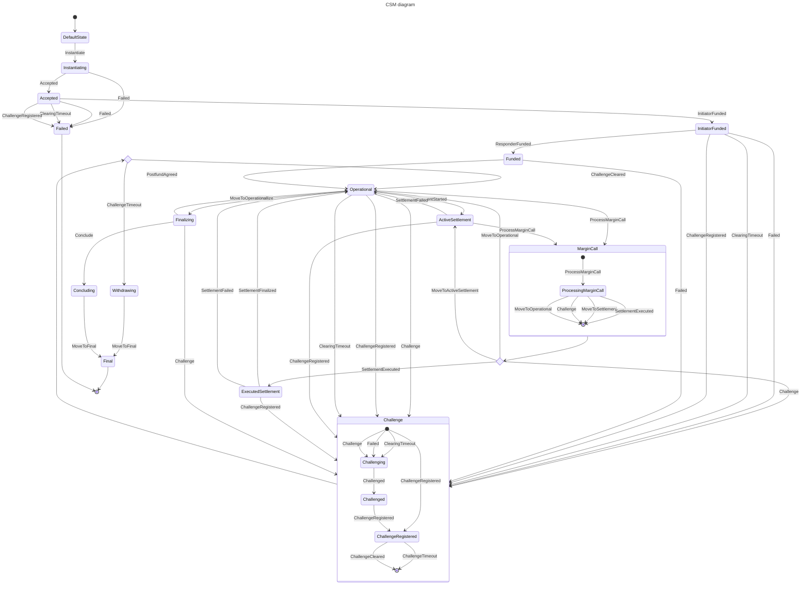

# 00011 - Clearing State Machine

## Status

Proposed

## Context

## Decision

### NFA CSM diagram

```mermaid
---
title: CSM diagram
---

stateDiagram-v2

   state challenge_exit <<choice>>


   state Challenge {
        [*] --> Challenging: Challenge
        [*] --> Challenging: Failed
        [*] --> Challenging: ClearingTimeout
        Challenging --> Challenged: Challenged
        Challenged --> ChallengeRegistered: ChallengeRegistered
        [*] --> ChallengeRegistered: ChallengeRegistered
        ChallengeRegistered --> [*]: ChallengeCleared

        ChallengeRegistered --> [*]: ChallengeTimeout
    }

   state margin_call_exit <<choice>>

    Challenge --> challenge_exit

    challenge_exit --> Operational: ChallengeCleared
    challenge_exit --> Withdrawing: ChallengeTimeout

    state MarginCall {
        [*] --> ProcessingMarginCall: ProcessMarginCall
        ProcessingMarginCall --> [*]: MoveToOperational
        ProcessingMarginCall --> [*]: Challenge
        ProcessingMarginCall --> [*]: MoveToSettlement
        ProcessingMarginCall --> [*]: SettlementExecuted
    }

    MarginCall --> margin_call_exit

    margin_call_exit --> Operational: MoveToOperational
    margin_call_exit --> ActiveSettlement: MoveToActiveSettlement
    margin_call_exit --> ExecutedSettlement: SettlementExecuted
    margin_call_exit --> Challenge: Challenge

    [*] --> DefaultState
    DefaultState --> Instantiating: Instantiate

    Instantiating --> Accepted: Accepted
    Instantiating --> Failed: Failed

    Accepted --> InitiatorFunded: InitiatorFunded
    Accepted --> Failed: Failed
    Accepted --> Failed: ClearingTimeout
    Accepted --> Failed: ChallengeRegistered

    InitiatorFunded --> Funded: ResponderFunded
    InitiatorFunded --> Challenge: Failed
    InitiatorFunded --> Challenge: ClearingTimeout
    InitiatorFunded --> Challenge: ChallengeRegistered

    Funded --> Operational: PostfundAgreed
    Funded --> Challenge: Failed

    Operational --> ActiveSettlement: SettlementStarted
    Operational --> Finalizing: Finalize
    Operational --> MarginCall: ProcessMarginCall
    Operational --> Challenge: Challenge
    Operational --> Challenge: ChallengeRegistered
    Operational --> Challenge: ClearingTimeout

    ActiveSettlement --> MarginCall: ProcessMarginCall
    ActiveSettlement --> Operational: SettlementFailed
    ActiveSettlement --> Challenge: ChallengeRegistered

    ExecutedSettlement --> Operational: SettlementFinalized
    ExecutedSettlement --> Operational: SettlementFailed
    ExecutedSettlement --> Challenge: ChallengeRegistered

    Finalizing --> Concluding: Conclude
    Finalizing --> Challenge: Challenge
    Finalizing --> Operational: MoveToOperational

    Withdrawing --> Final: MoveToFinal
    Concluding --> Final: MoveToFinal

    Final --> [*]
    Failed --> [*]
```
