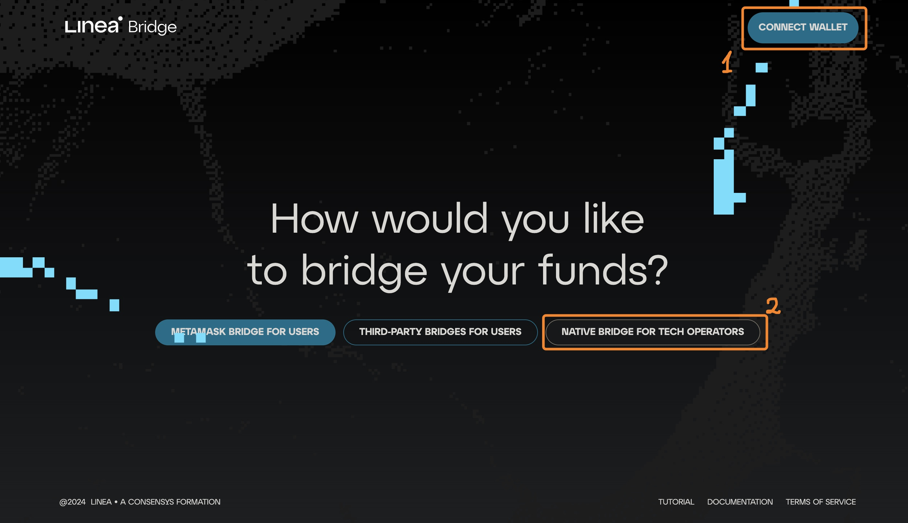
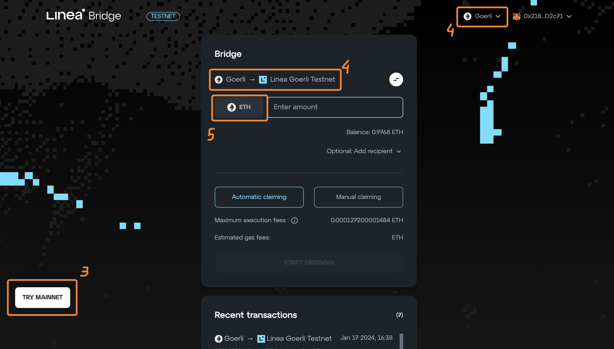
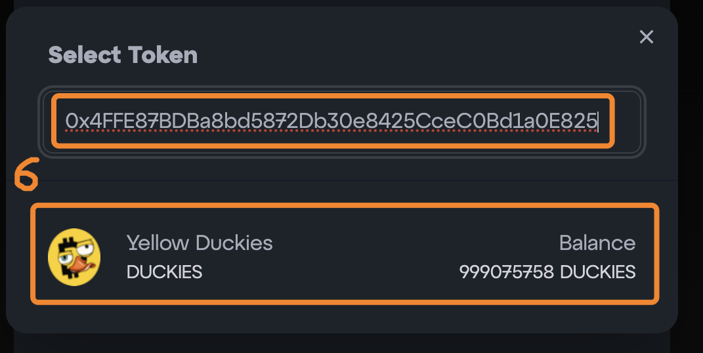
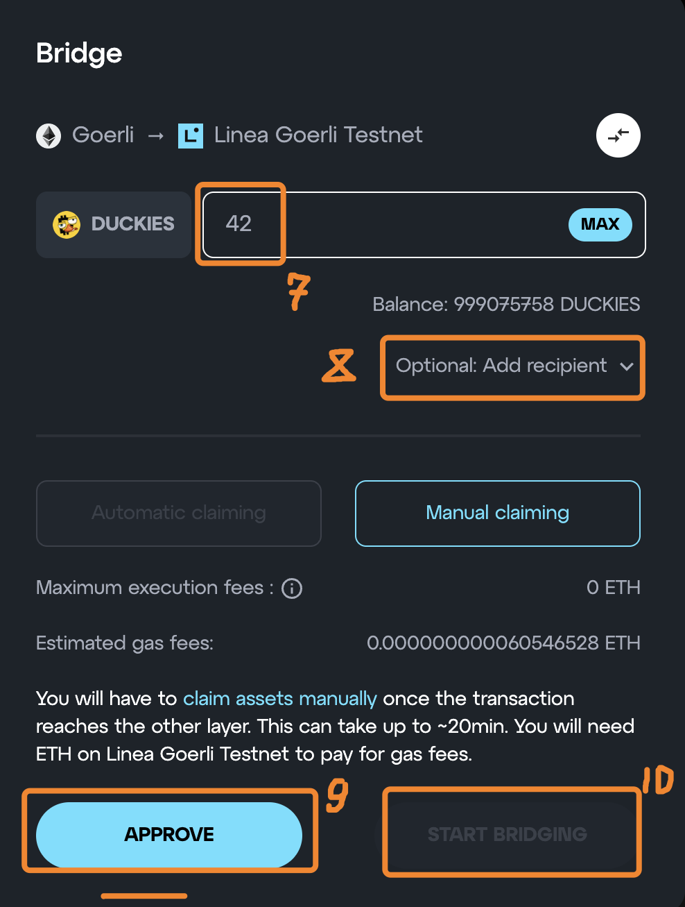
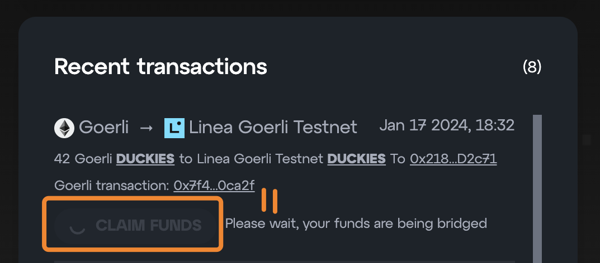

# Linea Bridge

[Official Linea Token Bridge](https://bridge.linea.build/) supports either [Vanilla ERC20](https://github.com/Consensys/linea-contracts/blob/3cf85529fd4539eb06ba998030c37e47f98c528a/contracts/tokenBridge/BridgedToken.sol) or Custom ERC20 tokens. The latter is the case only after direct integration with the Linea Bridge team.

## Linea Bridge Instructions

1. Go to [Linea Bridge](https://bridge.linea.build/) and connect your wallet with the corresponding "Connect Wallet" button.
2. Click the "Native Bridge For Tech Operators".

---

3. Click the "Try Mainnet/Testnet" button if you want to change the mainnet/testnet.
4. Select the network you want to bridge from.
5. Click on "ETH" to select the token you want to bridge.

---

6. Paste the token address you want to bridge from, and select the token from the dropdown menu.

---

7. Input the amount of tokens you want to bridge.
8. Optionally, you can input the recipient address. If you leave it blank, the tokens will be sent to the same address you are using to bridge the tokens.
9. Click the "Approve" button. You will be prompted to confirm the transaction on your wallet.
10. Click the "Bridge" button. You will be prompted to confirm the transaction on your wallet.

---

11. Wait for the bridging message to arrive on the destination chain. After that, click the "Claim Funds" button. You will be prompted to change the network and confirm the transaction on your wallet.
