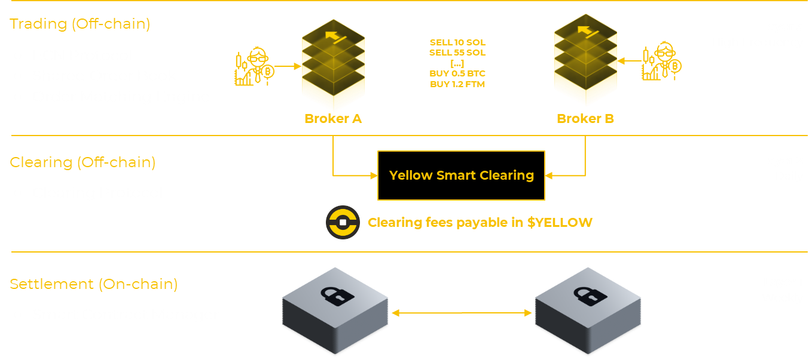

# Technical Paper - Yellow Network

[TOC]

## 1. Introduction to Yellow Network: Problems and Solution

### 1.1 Problems facing the crypto industry

As a new form of distributed ledger technology (DLT), Bitcoin has set out to decentralize the issuance of money as well as the transfer thereof through [a peer-to-peer electronic cash system](https://bitcoin.org/bitcoin.pdf)[^1]. Ensuing DLT systems like Ethereum generally referred to as [smart contract](https://ethereum.org/en/whitepaper/)[^2] or [general-purpose](https://www.oreilly.com/library/view/mastering-ethereum/9781491971932/ch01.html) blockchains,[^3] have been designed to decentralize trading and finance at large.

While blockchain technology has reliably enabled decentralized computation, current manifestations have yet to be able to scale to match the needs of traditional finance. Decentralized computation on a base layer blockchain, although secure, must be faster and improve the scalability of crypto trading. We are faced with an inherent [scalability trilemma](https://vitalik.eth.limo/general/2021/04/07/sharding.html)[^4], as of the end of February 2023, [126](https://blockchain-comparison.com/blockchain-protocols/)[^5] layer-1 blockchain protocols have been competing and experimenting in an attempt to find a solution.

Although we are convinced that much innovation will spring from this vibrant competition, the current blockchain environment must address three main problems. These are:

- Market and liquidity fragmentation

- Lack of decentralization

- Lack of regulatory frameworks

### 1.2 Market and Liquidity Fragmentation

Due to the proliferation of blockchains, there has been a fragmentation of assets and liquidity across different layer-1 protocols and increasingly [layer-2 chains](https://l2beat.com/scaling/tvl/)[^6]. Their interoperability is limited, having hitherto been dependent on centralized cross-chain bridges that have emerged as a [top security risk](https://blog.chainalysis.com/reports/cross-chain-bridge-hacks-2022/)[^7] due to the many substantial hacks that have [occurred](https://twitter.com/tokenterminal/status/1582376876143968256/photo/1)[^8] since September 2020.

Centralized crypto exchanges (CEXs) have rushed onto the scene to counteract market fragmentation. Over the last few years, [more than 200](https://coinmarketcap.com/rankings/exchanges/)[^9] CEXs have emerged worldwide. While many of them allow for the trading of digital assets across various blockchains, these CEXs remain isolated silos that trap liquidity. They all have their list of markets, which, unlike traditional finance, are neither global nor aggregated. Some exchanges even choose a set of blockchains they more closely work with, amplifying the overall market's fragmentation.

The dominance of CEXs in crypto trading has been hailed as one of the [big ironies](https://www.coindesk.com/markets/2019/03/30/the-ultimate-irony-of-crypto-trading/)[^10] of a world that wants to achieve decentralization. Thus, decentralized crypto exchanges (DEXs) have gained in popularity and volume, at one point in time even [driving on-chain transaction volumes past](https://blog.chainalysis.com/reports/defi-dexs-web3/)[^11] that of centralized platforms.

Although DEXs may provide many benefits over CEXs in terms of censorship resistance or accessibility, they are not yet of [sufficient quality to compete](https://www.snb.ch/n/mmr/reference/sem_2022_06_03_barbon/source/sem_2022_06_03_barbon.n.pdf)[^12] with the largest CEXs. One of their main problems is the fact that a DEX's blockchain-enabled transparency lends itself to [front-running](https://link.springer.com/chapter/10.1007/978-3-030-43725-1_13)[^13]. Also, they need more speed and have difficulty competing regarding transaction costs and price efficiency.

DEXs, characterized by their on-chain infrastructure, are not optimized for high-frequency trading operations. Compared to their centralized counterparts, DEXs often demonstrate a pronounced lack of market depth. The constrained market-making in DEXs can be attributed to liquidity providers accounting for volatility and potential security concerns associated with decentralized protocols. As a result, these providers often commit a restricted amount of capital in alignment with their risk assessment. It's also noteworthy that DEXs face challenges in maintaining consistent liquidity in the prevailing competitive landscape. A significant portion of the capital provided is transient, aptly termed [mercenary capital](https://www.mechanism.capital/native-token-liquidity/)[^14], which is prone to migrating swiftly in pursuit of superior short-term returns from competing platforms.

A recent analysis purports to [show](https://blog.bitfinex.com/media-releases/hodlers-put-faith-in-centralised-exchanges-as-platforms-flex-high-tech-security/)[^15] that crypto traders are more comfortable trading on CEXs given the growing threat of hacks that have materialized in the decentralized finance (DeFi) space over the course of this year. In the aftermath of the [FTX collapse](https://www.investopedia.com/what-went-wrong-with-ftx-6828447)[^16], this could be changing, as the inherent count party risk coming with CEXs could increasingly be seen as a significant disadvantage. While CEXs are striving to provide transparency by incorporating [proof of reserves](https://niccarter.info/proof-of-reserves/)[^17], in which a custodian transparently attests to the existence of on-chain reserve assets (but not liabilities), DEXs are working towards solving their [blockchain-based scalability issues](https://www.researchgate.net/publication/342639281_Scaling_Blockchains_A_Comprehensive_Survey)[^18].

### 1.3 Lack of decentralization and distribution

As the current situation reveals, even though decentralization is considered the driving force within the crypto space, it is far from reality. What is referred to as "[decentralization theater](https://www.imf.org/en/Publications/fandd/issues/2022/09/Defi-promise-and-pitfalls-Fabian-Schar)[^19]" creates a risk of deception as, in many cases, DeFi protocols remain heavily centralized.

Even with most DEXs, there is no genuinely decentralized trading. For example, some DEXs may still rely on a central entity to control the flow of buy and sell orders, which allows them to prevent users from placing orders. Others use third-party accounts to facilitate transactions, rendering them custodial in nature. Regarding their underlying technology, blockchain computing is not distributed, as all machines re-compute the same code to reach a consensus. Liquidity in DEXs is concentrated within a single chain, limiting the extent of decentralization. In stark contrast, the global shipping industry exemplifies genuine decentralization. It comprises a vast interconnected network of companies, each playing a distinct role, collectively ensuring the industry's seamless operation without central oversight.

### 1.4 Lack of regulatory frameworks

Undeniably, DEXs with centralized components must be subject to the regulatory standards that CEXs must follow. However, this is not the case, as specific crypto industry regulations are still missing. Consequently, this lack of regulatory frameworks leads to the fact that there is no separation of responsibilities -- mostly among CEXs. They are doing everything: Managing their security in-house, doing their custody, sometimes issuing their stablecoin, launching investment products, or acting as a launchpad. Those practices not only create a conflict of interest since CEXs act as marketplaces, market makers, liquidity providers, and custodians, but with this concentration in services, much trust ends up being placed in CEXs - the opposite of what the blockchain space is about.

The three problems described above have ailed the crypto industry ever since, leading to inefficient processes and high costs. Running an exchange across many blockchains and markets requires costly market makers providing crucial liquidity. The more fragmented the liquidity, the higher the costs to make markets.

DEXs lack legal protections as they do not fall under any regulatory scrutiny and oversight. CEXs do abide by some regulations. However, they remain [shadow banks](https://corporatefinanceinstitute.com/resources/cryptocurrency/shadow-banking-and-cryptocurrencies/)[^20] concerning traditional regulations. Moreover, complying with local regulations comes with high costs for a CEX, especially when applying for business in many nations. Some CEXs choose to register in a country that allows them to operate with almost any regulations, or they operate offshore and offer barely any consumer protection. The latest exposes users to the platform's goodwill and can lead to further costs once the CEX is forced to reduce or even cut user access due to non-compliance with regulations—lastly, hacks resulting from backdoors due to insufficient protocol decentralization cause costs for users and the industry.

### 1.5 Solution for the problems

[Yellow Network](https://www.yellow.org/)[^21] is designed to solve these problems. The decentralized model Yellow envisions is one in which businesses work together, utilizing a shared backbone for liquidity, similar to how thousands of internet service providers and network firms are interconnected and regulated in their respective countries.

By connecting brokers and exchanges, Yellow Network acts as a blockchain-agnostic mesh network of connected nodes that aggregate liquidity cross-chain, increasing efficiency, lowering slippage, and allowing for best trades execution. To unlock high-speed trading, Yellow Network uses a layer-3 state channel infrastructure, allowing for communication and trading between brokers and exchanges in a decentralized way. In other words, Yellow Network is a broker-to-broker liquidity channel infrastructure.

As such, Yellow Network is not based on any single blockchain but a network of different intermediate nodes powered by Yellow Network code and run by brokers and exchanges connected. This way, Yellow Network participants can do high-frequency trading among each other in a peer-to-peer way, using a smart clearing protocol to pool on-chain collateral that minimizes counterparty risks and protects broker-to-broker liabilities exchanged off-chain.

Yellow Network's centerpiece is its state channel smart clearing protocol, which is fully decentralized. The collateral locked in a state channel is controlled by a smart contract that is ultimately controlled by the parties that have opened the state channels. Thus, no funds are ever under the control of Yellow Network, making the system non-custodial from the perspective of its participants.

By creating a clearing and settlement system for communicating trading liabilities, updating states within state channels, and carrying out state channel challenges, Yellow Network is a combination of the [SWIFT](https://www.swift.com/about-us/discover-swift/messaging-and-standards)[^22] messaging protocol as well as an [ECN](https://www.angelone.in/knowledge-center/share-market/ecn-electronic-communication-network)[^23] direct order matching protocol. While SWIFT and ECN facilitate a broker's access to global financial markets of traditional markets, Yellow Network does the same for digital assets. Through this clear-cut setup, Yellow Network separates powers, duties, and responsibilities by mimicking one essential part of the traditional finance stack -- the clearing house.

## 2. Yellow Network: High-level Explanation

To grasp the intricacies of the Yellow Network protocol, one must first gain a broad overview of its components. This can be effectively achieved by distinguishing between three distinct protocol layers within the Yellow Network:

1. Blockchain Layer Protocol: This section hosts the ClearSync, a smart clearing method. Its main job is to begin, watch over, and end state channels between trade partners. It works by putting in and taking out a security deposit. This deposit acts as shared protection when trading. Even though this deposit is on the Ethereum blockchain, partners can trade digital assets on many other blockchains.

2. Margin call protocol: This is specific to Yellow Network. The protocol updates the collateral state in the state channels agreed between trading partners through an off-chain RPC protocol.

3. Trading protocol: This protocol is not specific to Yellow Network and can be proprietary software. It can be FIX, Rest-JSON, Binance API, Bitfinex API, or any banking protocol.

_Yellow Network's different layers are visualized._

As we can see, Yellow Network is bringing a smart clearing protocol based on state channels, combined with an off-chain RPC protocol connected to proprietary trading software. At its core, Yellow Network is simply a protocol based on smart contract technology to track trading liabilities between Yellow Network trading parties. It is designed to be flexible, simple, and agnostic--- all following the [KISS design principle](https://www.interaction-design.org/literature/article/kiss-keep-it-simple-stupid-a-design-principle)[^24]. This way, existing institutions don't need to change their systems and can use their proprietary trading, settlement, and custody protocols to adopt Yellow Network.

## 3. How does Yellow Network work?

### 3.1 Overlay mesh network for high-frequency trading

As a clearing and settlement network, Yellow Network connects multiple brokers and exchanges into one shared order platform. This platform spans multiple blockchains. By sitting on top of a network of blockchains, Yellow Network brings all parties like brokers, trading firms, exchanges, and blockchains together, creating a decentralized, global trading network that gives rise to a more efficient trading infrastructure supporting high-frequency trading.

The connection points to each blockchain are established through custodians on all the various chains -- they act as gateways, enabling Yellow Network participants to trade with one another across chains seamlessly. The brokers using Yellow Network are connected to these different custodians, and the latter maintains a direct connection to the different blockchains, as they are the ones storing the on-chain assets on behalf of brokers. Thus, through its network of custodians, Yellow Network is integrated with every connected blockchain, which allows for asset virtualization in each chain.

End users willing to get a specific asset from any supported blockchain need to withdraw it directly from the relevant custodian integrated with the specific blockchain. Significantly, brokers automate and hide this part, the same way users can conveniently withdraw any cryptocurrency from Binance. This setup makes Yellow Network a layer-3 for fast clearing trades on top of a blockchain. It is not a blockchain itself but uses blockchain technologies at its core.

This blockchain-agnostic layer-3 overlay mesh network of connected nodes run by brokers, exchanges, and trading firms aggregating liquidity cross-chain reduces overall market fragmentation, market depth is added, and best trade execution is made possible. Ultimately, smaller, more specialized trading venues profit from liquidity aggregation as it helps them offer better pricing and handle larger trading volumes. Also, end users can trade additional token pairings because exchanges, brokers, and trading firms are connected through one mesh network.

### 3.2 State channels infrastructure and multi-chain support

Yellow Network's state channel infrastructure and the multi-chain support are two different things that need to be distinguished -- yet they are both part of the overall system. Through its multi-chain support, Yellow Network is not based on a single blockchain but allows to trade, clear, and settle assets in any tokenized asset on various blockchains. Thus, Yellow Network participants can trade assets across blockchain and cryptocurrencies, DeFi tokens, NFTs, or even real-world assets (RWA) tokens.

The state channel infrastructure makes up the backbone or nervous system of the Yellow Network and allows for the locking and unlocking of collateral in state channels integrated into the Ethereum blockchain (though the Canary test might take place on Polygon). Importantly, liabilities exchanged between state channel trading participants are not written into state channels. Only the collateral that resides within state channels is on-chain.

Liabilities are exchanged, and settlements, including asset transfers, occur outside the state channel framework via direct transactions between custodians. To confirm a settlement, both participants in a state channel must show consensus by endorsing the updated balance sheet. This action ensures that the state channel reflects the most recent status.

If a Yellow Network member fails to settle based on the agreed liabilities, the collateral secured in a smart contract can be claimed by the party owed. This mechanism is facilitated by the on-chain 'adjudicator' smart contract, which manages collateral according to specific protocol rules. All parties consent to utilize the state channel smart contract protocol, termed ClearSync, for dispute resolution. The collateral is represented as ERC-20 tokens on Ethereum. As a result, only Ethereum-based assets like WBTC, WETH, USDT, USDC, or DAI are used as collateral and for dispute resolution.

### 3.3 Decentralized trading through an aggregated order book

Yellow Network applies a multi-layered order book anatomy to facilitate decentralized trading, aggregating order books across participants into one global network. Starting from their local order book, each Yellow Network participant can synchronize their order book with the overall network, giving rise to an aggregated Yellow Network order book.

With its network of brokers and custodians, integrated with today's wide variety of blockchains, and its state-channels-powered smart clearing protocol for collateral underwriting trading relationships, Yellow Network can allow decentralized trading. All institutions can efficiently utilize Yellow Network with their proprietary trading software, making it possible to trade digital assets and any other tokenized asset like gold, stocks, or bonds.

Making such a decentralized trading infrastructure more accessible and reliable will encourage the development of Internet-native finance, giving rise to what is generally called the Internet of value across the entire spectrum of today's economic actors and institutions. Not only will traditional players be able to provide products and services related to the Internet of value, but such an Internet-native financial infrastructure will enable thousands of startups to tap into, utilize, and innovate. Similarly to how Amazon Web Services spawned the development of the Web 2.0 ecosystem or Google Cloud is contributing to the development of artificial intelligence.

## 4. The technical basis of Yellow Network

### 4.1 Why state channels?

Enhancing blockchain scalability remains a critical advancement in the crypto realm to achieve mass adoption. The Ethereum Network handles \~15 TPS (transactions per second), considerably below the rate required to serve millions of users effectively and dependably. Still, as the most significant smart contract blockchain, Ethereum is building a scalable unified settlement and data availability layer.

In doing this, Ethereum [has pivoted](https://members.delphidigital.io/reports/the-hitchhikers-guide-to-ethereum)[^25] to a rollup-centric roadmap. This fact is [reflected](https://www.theblock.co/data/scaling-solutions/scaling-overview/value-locked-of-ethereum-scaling-solutions)[^26] in the value locked in Ethereum scaling solutions, which are dominated by the rollup type. Nonetheless, Yellow Network operates on state channel technology because its decentralized, global trading network is optimized for low-latency and high-frequency attributes rollups cannot provide.

In comparison to state channels, rollups are limited in what they can optimize for. For example, they are not optimized for ERC-20 transfers, in which the majority of transaction volume is in. [Rollups](https://members.delphidigital.io/reports/the-hitchhikers-guide-to-ethereum)[^27] work by moving heavy and resource-intensive smart contract computations from the main chain to a separate layer, or "rollup". This offloading reduces the load on the main chain and allows for faster processing of transactions. However, ERC20 transfers, which only involve state modifications of a balance, are not considered heavy computations. Thus, rollups do not offer any advantages in that regard.

Furthermore, the performance of rollups is far from what state channels offer. They are not only slower but not as scalable as state channels. With state channels, one is limited by hardware and network latency regarding transaction throughput. Rollups, on the other hand, need a separate architecture for advanced verification. Also, rollups are not cross-chain, while state channels are. Last, state channels allow transactions between two or more parties without involving any third party, unlike rollups, whose transactions are [processed](https://ethereum.org/en/developers/docs/scaling/optimistic-rollups/)[^28] by an operator at present.

The high performance, the absence of third parties, and the suitability for a wider variety of use cases, as the cross-chain aspect, are all attributes Yellow Network is maximizing for, which is why state channel technology is used as the preferred scaling solution type.

### 4.2 What are state channels?

The concept of state channels was [introduced](https://ieeexplore.ieee.org/document/9627997)[^29] in 2015. An off-chain scaling mechanism enables transacting parties to interact without touching the blockchain. Only the final state between them is broadcasted and settled on-chain. The most prominent peer-to-peer state channel network in action is the [Bitcoin Lightning Network](https://lightning.network/)[^30], a second-layer protocol that was [introduced](https://lightning.network/lightning-network-paper.pdf)[^31] in 2016. It is based on payment channels, which are payment-specific state channel applications. Nonetheless, the Bitcoin Lightning Network is an excellent demo of how state channels work.

Typically, a channel can be built upon [threshold signatures](https://ieeexplore.ieee.org/document/4118696)[^32]--- often referred to as multi-signature or multisig --- and instructions for timelocks. Channel participants sign a multi-signature smart contract and lock in funds to participate. Following the lock-up of funds, any number of states can be exchanged among participants. Such states can [represent](https://arxiv.org/pdf/2204.08032.pdf)[^33] any generalized application, enabling state channels to enable many use cases. Because state exchanges happen off-chain, they allow for fast transactions and high throughput.

In the context of trading, for example, traders can make x number of off-chain transactions between each other during the day, and by the evening, all parties involved can mutually settle trades by officially posting the final net balance between them. Every trader would get what is due to him.

### 4.3 The Benefits of State Channels

As a blockchain scaling solution, state channels [offer](https://docs.ethhub.io/ethereum-roadmap/layer-2-scaling/state-channels/)[^34] various benefits. Among them are:

- State channels are ultra-fast and massively scalable

- State channels are blockchain agnostic

- State channels offer confidentiality

- State channels are Web2 compatible

Yellow Network has identified that state channels, thanks to their advantages, provide the necessary solution to address the current challenges Web2 companies are facing when wanting to interact with blockchain technology. Because of path dependency, it is unlikely that today \'s [highly developed internet infrastructure](https://www.internetlivestats.com/)[^35], [with its](https://everysecond.io/the-internet)[^36] billions of websites, millions of servers, and thousands of Web2 companies, will go through a complete overhaul to become blockchain-compatible. It is much more likely that state channels will act as a middleware solution between blockchains and legacy information systems.

Through its state channel-based layer-3 technology, Yellow Network enables Web2 companies to have a more straightforward way to connect legacy internet infrastructure to the new Internet of value powered by blockchains. This way, smart contracts will make up a more significant part of existing web companies and become more accessible to operate for them. At the same time, thanks to Yellow Network's integrated state channels technology, these companies do not need to wait for node validation or block creation when having blockchain-based transactions processed.

Instead, any Web2 company can easily integrate with blockchains and use them in their day-to-day business efforts. To become a peer in Yellow Network's peer-to-peer (P2P) trading platform, they must open a state channel with other participants through a Yellow Network node.

## 5. Yellow Network's Solution explained and Architecture deep dive

_Yellow Network's overlay mesh network of Yellow network nodes._

### 5.1 Running a Yellow Network Node

The Yellow Network enables peer-to-peer trading by connecting its members via Yellow Network nodes. This results in an expansive trading ecosystem with numerous participants contributing to and pooling liquidity on the network. Each participant operates a high-performance Yellow Network node, vital to the platform's trading functionality. These nodes seek out other Yellow Network nodes, facilitating communication among participants.

Furthermore, Yellow Network nodes are crucial for setting up state channels, locking collateral, and making the logic eligible for both state channel parties. A protocol like [LibP2P](https://libp2p.io/) is most likely used for communication among Yellow Network nodes. This protocol allows nodes to discover other nodes and send messages to them. As such, it is a way to connect servers in a mesh network, thereby giving rise to Yellow's peer-to-peer network.

### 5.2 A world map of Yellow Network's Liquidity

Yellow Network relies on an aggregated orderbook shared across network participants to facilitate decentralized trading. This shared orderbook has unlimited capacity for the participants' requests. Because the orderbook is hosted with individual participants, it resists any work interruptions. Should any network participants go down, the globally shared orderbook would still be accessible to traders on Yellow Network.

This aggregated orderbook is established when Yellow Network participants synchronize their orderbook with the network, giving rise to the aggregated order book of Yellow Network. "Aggregated" means that Yellow Network collects and orders feeds that Yellow Network participants get from other participants and their counterparties.

This is accomplished by utilizing LibP2P to create a peer-to-peer network among Yellow Network nodes that facilitates communication and discovery. Within LibP2P, the [publish-subscribe](https://docs.libp2p.io/concepts/pubsub/overview/)[^37] feature is utilized to relay real-time price quotes happening across the network, providing a live stream map of liquidity and prices globally.

This information can be used as a routing table to decide the optimal node connections. Upon connecting to the network, each node subscribes to the quotes it wishes to track, for example, WBTC/USDT. It then receives price updates from all nodes in the global network and can compute a routing table based on the state channels it has already established. A Yellow network node may create additional direct or virtual channels to access attractive prices or spreads.

_Yellow Network provides a world map of liquidity participants can tap into._

So, by joining Yellow Network, every participant is provided with a world map of liquidity, showing where it is, what prices there are, and how this liquidity can be accessed most efficiently. It is similar to how [BitTorrent](https://web.cs.ucla.edu/classes/cs217/05BitTorrent.pdf)[^38] maps all files. Yellow Network does the same for trading data instead of files. Joining Yellow Network gives access to this map, making it easier to find and access liquidity.

### 5.3 State Channels Smart Clearing Protocol: ClearSync

At the heart of Yellow Network is its smart clearing protocol. It exists as a set of automated smart contracts that allow participants to lock and unlock collateral through state channels to protect the clearing and settlement of assets.

This state channels protocol allows Yellow Network participants to minimize risks when exchanging trading liabilities or assets owned and owed from one participant to another. When an exchange trades with another broker, they exchange liabilities using Yellow Network's protocol, ensuring mutual consent regarding the accounting side.

The distribution ratio within the state channels operated by participants is updated continuously (preferably every second). This way, both participants can constantly monitor the most current state within their channel, thereby preventing either participant from being defrauded. Should counterparty settlement risk become imbalanced, the trading party carrying the risk can ask the other party to provide more collateral using a margin call.

_Brokers can trade with one another, while Yellow Network acts as the clearing house between them._

Thus, Yellow Network also provides the option for unilateral collateral settlement, whereby if a broker's balance sheet is \$5,000 higher than that of his trading partner, inequalities can be rebalanced by having the trading partner with the lower balance sheet provide the necessary collateral to settle the difference and re-equalize the trading liabilities. This process would result in a partial settlement, enabling both brokers to readjust the margin of collateral and continue trading.

Should either party not agree to rebalance or settle the liabilities, the defrauded party can refer to the latest state within the state channel and have the smart contract to release the collateral in their favor. As a result, the party that has been defrauded will get the necessary funds to cover up for what is entitled to them. The participants can use those funds to buy the assets not provided through the other party's settlement.

One must remember that the actual trading, clearing, and settlement of assets between Yellow Network participants are not directly initiated by the state channels protocol. It is done by either broker, exchange, or trading firm, moving owed funds between one another. It means that, technically, liabilities are not written into state channels but kept in the database of the respective parties. They use a system of gossip-to-gossip communication to determine the amount of collateral required to continue their business activities and ensure that both parties and potential risks are protected.

_Three crucial components comprise the Yellow Network: Trading and Clearing (off-chain) and settlement (on-chain)._

It is only the collateral that resides within state channels. Therefore, state channels do neither know about the liabilities that are being traded nor do they know about their prices. They know the distribution ratio of the collateral provided and signed by the different state channel participants. Liabilities will be exchanged off-chain using Yellow Network's protocol, not on-chain transactions. However, the state channels smart clearing protocol Clear Sync helps accurately monitor and thus rebalance collateral positions atomically between trading partners.

To perform actual settlement of on-chain assets, brokers will have different ways to proceed:

- Using proper off-chain database and API infrastructure

- Using on-chain escrow smart contract or HTLC

If two trading partners within Yellow Network have the same custodians, the assets don't need to be moved on-chain but can be cleared by updating the mutual custodian's accounting database. This mechanism is similar to how money is moved between people who have the same bank and transfer money amongst each other. While the owner changes and accounting states are adjusted, no money is moved around.

Using on-chain escrow smart contracts or HTLC instead allows for [atomic settlement](https://r3.com/everyday-blockchain/atomic-settlement-if-you-have-amazon-prime-you-already-understand-the-process/)[^39]. HTLCs are referred to as [Hashed TimeLock Contracts (HTLCs)](https://medium.com/hackernoon/what-are-hashed-timelock-contracts-htlcs-application-in-lightning-network-payment-channels-14437eeb9345)[^40] and are popularly used in the context of the Lightning Network. They are a smart contract that ensures that a transfer between parties, performed before an expiration time, allows these parties to carry out an atomic swap of assets without a third party. [Using an HTLC](https://www.researchgate.net/publication/358898825_Generalized_HTLC_for_Cross-Chain_Swapping_of_Multiple_Assets_with_Co-Ownerships)[^41] for the settlement process can move funds from one broker \'s custody to another on an atomic level and multiple blockchains.

## 6. How to Participate in Yellow Network

Participants must provide and lock Yellow Network tokens to participate in Yellow Network. To fund the collateral in a state channel, participants need to supply the collateral as stablecoins. The amount of collateral deposited into a state channel is called a [state deposit](https://eprint.iacr.org/2019/219)[^42]. Once both parties agree on the collateral amount and have deposited the stablecoins to the smart contract, funds will be locked in the adjudicator smart contract called ClearSync. This smart contract sits in between Yellow Network participants. Through the adjudicator smart contract, Yellow Network's smart clearing protocol takes care of brokers\' collateralization levels and liability risk management in real-time.

With the funds locked by the adjudicator smart contract, the state channel is opened, and its participants can start trading. With every act of trading, the state channel receives state updates from either participant, upgrading the state channel according to the most recent trading activity. Closing a state channel is done by producing a final state transition. Closing a channel will cause an automatic settlement of all open positions and clear liabilities and lead to unlocking each participant's collateral if no dispute about the final state within the channel is in progress.

## 7. Yellow Network Application

As already indicated, there will be an application to run the Yellow Network node so interested parties can run it on their servers. This software will handle network-related activities like communicating liabilities, updating states within state channels, and resolving disputes. Brokers, exchanges, and trading firms can become Yellow Network participants through this gateway. They are the primary target audience that Yellow Network is trying to reach.

While big exchanges and trading firms are welcome to join and profit from the network effects of Yellow Network, and Openware will work on onboarding big players that bring liquidity and users, smaller- and middle-tier exchanges represent ideal participants of Yellow Network. Because of increased competition and liquidity fragmentation, smaller players might be unable to keep up with the fierce competition in the mid to long run, making them ideal candidates to use Yellow Network.

Thus, Yellow Network offers a survival solution to them by letting them team up and combine their powers with other exchanges. By uniting different exchange small- and middle-tier exchanges through Yellow Network, this network of exchanges can gain more liquidity, making them fit to compete with behemoth exchanges like Binance or Huobi. Therefore, the primary value proposition of the Yellow Network lies in offering small to mid-sized exchanges an opportunity to offer their liquidity to the network. Concurrently, they benefit from the liquidity provided by other participants in the Yellow Network, ensuring they remain competitive in the market.

## 8. Technology Partners

### 8.1. Openware with OpenDAX

[Openware](https://www.openware.com/)[^43], Inc. is a United States multinational blockchain infrastructure development company headquartered in South San Francisco, California, that designs, develops, and sells computer software and online services. They focus on building secure and scalable solutions for Web3 and the Internet of finance.

[OpenDAX](https://www.openware.com/product/opendax)[^44] is Openware's flagship product and stands for \ 'Open-Source Digital Assets Exchange\'. It is a hybrid software consisting of public and private libraries, designed to build a fully-featured exchange service to facilitate trading digital assets, cryptocurrencies, and security tokens. OpenDAX^TM^ is cloud-based, and while it comes as a plug-and-play solution that can easily be deployed, it is possible to customize the solution per one's needs.

Through operating and selling OpenDAX^TM^, the need for Yellow Network has become apparent. The idea for starting Yellow Network came from Openware's clients who have been starting their exchange using OpenDAX^TM^. They have always been facing the issue of raising and obtaining sufficient liquidity.

Building out Yellow Network as a built-in solution and natively supported platform for OpenDAX^TM^ users would help brokers and clients efficiently source deep pockets of liquidity, thereby solving their bootstrapping problem that has so far hampered the adoption of OpenDAX^TM^ and thus the creation of more brokers and exchanges within the crypto trading space. While the need for some primary market-making will persist, creating Yellow Network will simplify things and cut costs for brokers and smaller exchanges wanting to do business in crypto trading.

[^1]: Nakamoto Satoshi, "Bitcoin: A Peer-to-Peer Electronic Cash System." [www.bitcoin.org](http://www.bitcoin.org), October 2008: <https://bitcoin.org/bitcoin.pdf>
[^2]: Buterin Vitalik, "Ethereum White paper." [www.ethereum.org](http://www.ethereum.org), November 2014: <https://ethereum.org/en/whitepaper/>
[^3]: Antonopouos Andreas, Wood Gavin, "Mastering Ethereum." O\'Reilly Media, Inc., November 2018: <https://www.oreilly.com/library/view/mastering-ethereum/9781491971932/>
[^4]: Buterin Vitalik, "Why sharding is great: demystifying the technical properties." [www.vitalik.eth.limo](http://www.vitalik.eth.limo), April 2021: <https://vitalik.eth.limo/general/2021/04/07/sharding.html>
[^5]: Blockchain Comparison: <https://blockchain-comparison.com/blockchain-protocols/>
[^6]: L2beat: <https://l2beat.com/scaling/tvl/>
[^7]: Chainalysis Team, "Vulnerabilities in Cross-chain Bridge Protocols Emerge as Top Security Risk." Chainalysis Blog, August 2022: <https://blog.chainalysis.com/reports/cross-chain-bridge-hacks-2022/>
[^8]: Token Terminal, "Bridge exploits account for \~50% of all DeFi exploits, totaling \~\$2.5B in lost assets." Token Terminal Twitter, October 2022: <https://twitter.com/tokenterminal/status/1582376876143968256>
[^9]: Coinmarketcap, "Top Cryptocurrency Spot Exchanges." Coinmarketcap Website: <https://coinmarketcap.com/rankings/exchanges/>
[^10]: Weisberger David, "The Ultimate Irony of Crypto Trading." Coindesk, September 2021: <https://www.coindesk.com/markets/2019/03/30/the-ultimate-irony-of-crypto-trading/>
[^11]: Chainalysis Team, "DeFi-Driven Speculation Pushes Decentralized Exchanges' On-Chain Transaction Volumes Past Centralized Platforms." Chainalysis Blog, June 2022: <https://blog.chainalysis.com/reports/defi-dexs-web3/>
[^12]: Barbon Andrea , Ranaldo Angelo, "On The Quality Of Cryptocurrency Markets: Centralized Versus Decentralized Exchanges." SNP Paper, April 2022: <https://www.snb.ch/n/mmr/reference/sem_2022_06_03_barbon/source/sem_2022_06_03_barbon.n.pdf>
[^13]: Eskandari, S., Moosavi, S., Clark, J.: SoK: Transparent Dishonesty: Front-Running

    Attacks on Blockchain. In: Financial Cryptography. pp. 170--189. Springer International Publishing, Cham (2020): <https://link.springer.com/chapter/10.1007/978-3-030-43725-1_13>

[^14]: Wu, Eva, "The Art and Science of Native Token Liquidity" Mechanism Capital, August 2021: <https://www.mechanism.capital/native-token-liquidity/>
[^15]: Bitfinex, "Hodlers Put Faith in Centralised Exchanges as Platforms Flex High-Tech Security." Bitfinex Blog, October 2022: <https://blog.bitfinex.com/media-releases/hodlers-put-faith-in-centralised-exchanges-as-platforms-flex-high-tech-security/>
[^16]: Reiff Nathan, "The Collapse of FTX: What Went Wrong with the Crypto Exchange?" Investopedia, December 2022: <https://www.investopedia.com/what-went-wrong-with-ftx-6828447>
[^17]: Carter Nic, "Nic's PoR: Wall of Fame" Nic Carter Website: <https://niccarter.info/proof-of-reserves/>
[^18]: Hafid, Abdelatif, Senhaji Hafid Abdelhakim, Samih Mustapha, "Scaling Blockchains: A Comprehensive Survey." IEEE Access, July 2020: <https://www.researchgate.net/publication/342639281_Scaling_Blockchains_A_Comprehensive_Survey>
[^19]: Schär Fabian, "DeFi's Promise and Pitfalls." IMF, September 2022: <https://www.imf.org/en/Publications/fandd/issues/2022/09/Defi-promise-and-pitfalls-Fabian-Schar>
[^20]: CFI Team, "What is Shadow Banking in the Cryptocurrency World?", Corporate Finance Institute, February 2023: <https://corporatefinanceinstitute.com/resources/cryptocurrency/shadow-banking-and-cryptocurrencies/>
[^21]: Yellow Network: <https://www.yellow.org/>
[^22]: Discover Swift: <https://www.swift.com/about-us/discover-swift/messaging-and-standards>
[^23]: What is ECN: <https://www.angelone.in/knowledge-center/share-market/ecn-electronic-communication-network>
[^24]: Kiss Design Principle: <https://www.interaction-design.org/literature/article/kiss-keep-it-simple-stupid-a-design-principle>
[^25]: Charbonneau, Jon, "The Hitchhiker \'s Guide to Ethereum." Delphi Digital, May 2022: <https://members.delphidigital.io/reports/the-hitchhikers-guide-to-ethereum>
[^26]: The Block: "Value Locked in Ethereum Scaling Solutions by Type." <https://www.theblock.co/data/scaling-solutions/scaling-overview/value-locked-of-ethereum-scaling-solutions>
[^27]: Thibault Louis Tremblay, Sarry Tom, Hafid Abdelhakim Senhaji, "Blockchain Scaling Using Rollups: A Comprehensive Survey" IEEE Access, August 2022: <https://ieeexplore.ieee.org/stamp/stamp.jsp?arnumber=9862815>
[^28]: Isthedoom, "Optimistic Rollups." [www.ethereum.org](http://www.ethereum.org), November 2022: <https://ethereum.org/en/developers/docs/scaling/optimistic-rollups/>
[^29]: Negka Lydia, Spathoulas Georgios, "Blockchain State Channels: A State of the Art." IEEE Access, November 2021: <https://ieeexplore.ieee.org/document/9627997>
[^30]: Lightning Network: <https://lightning.network/>
[^31]: Poon Joseph, Dryja Thaddeus, "The Bitcoin Lightning Network: Scalable Off-Chain Instant Payments." January 2016: <https://lightning.network/lightning-network-paper.pdf>
[^32]: Van Der Merwe Johann, Dawoud, McDonald Stephen, "A Fully Distributed Proactively Secure Threshold-Multisignature Scheme." IEEE Access, March 2007: <https://ieeexplore.ieee.org/document/4118696>
[^33]: Gangwal Ankit, Gangavalli Haripriya, Thirupathi Apoorva, "A Survey of Layer-Two Blockchain Protocols." Elsevier Journal of Network and Computer Applications, April 2022: <https://arxiv.org/pdf/2204.08032.pdf>
[^34]: "State Channels." Docs EthHub: <https://docs.ethhub.io/ethereum-roadmap/layer-2-scaling/state-channels/>
[^35]: Internet Live Stats: <https://www.internetlivestats.com/>
[^36]: The Internet -- Every Second: <https://everysecond.io/the-internet>
[^37]: Docs.libp2p - What is Publish/Subscribe: <https://docs.libp2p.io/concepts/pubsub/overview/>
[^38]: Johnsen Jahn, Karlsen Lars, Birkeland Sebjørn, "Peer-to-peer networking with BitTorrent." Department of Telematics, December 2005: <https://web.cs.ucla.edu/classes/cs217/05BitTorrent.pdf>
[^39]: R3, "Atomic settlement: if you have Amazon Prime, you already understand the process", February 2022: <https://r3.com/everyday-blockchain/atomic-settlement-if-you-have-amazon-prime-you-already-understand-the-process/>
[^40]: Vohra Arnav, "What Are Hashed Timelock Contracts (HTLCs)? Application In Lightning Network & Payment Channels." [www.hackernoon.com](http://www.hackernoon.com), May 2018: <https://medium.com/hackernoon/what-are-hashed-timelock-contracts-htlcs-application-in-lightning-network-payment-channels-14437eeb9345>
[^41]: Krishnasuri Narayanam, Ramakrishna Venkatraman, Dhinakaran Vinayagamurthy, Sandeep Nishad, "Generalized HTLC for Cross-Chain Swapping of Multiple Assets with Co-Ownerships." February 2022: <https://www.researchgate.net/publication/358898825_Generalized_HTLC_for_Cross-Chain_Swapping_of_Multiple_Assets_with_Co-Ownerships>
[^42]: Close Tim, "Nitro Protocol" February 2019: <https://eprint.iacr.org/2019/219>
[^43]: Openware: <https://www.openware.com/>
[^44]: OpenDAX: <https://www.openware.com/product/opendax>
